# IaaS VM with CosmosDB Tier 4 `[App/IaasVmCosmosdbTier4]`

Creates an IaaS VM with CosmosDB Tier 4 resiliency configuration.

You can reference the module as follows:
```bicep
module iaasVmCosmosdbTier4 'br/public:avm/ptn/app/iaas-vm-cosmosdb-tier4:<version>' = {
  params: { (...) }
}
```
For examples, please refer to the [Usage Examples](#usage-examples) section.

## Navigation

- [Resource Types](#Resource-Types)
- [Usage examples](#Usage-examples)
- [Parameters](#Parameters)
- [Outputs](#Outputs)
- [Cross-referenced modules](#Cross-referenced-modules)
- [Notes](#Notes)
- [Data Collection](#Data-Collection)

## Resource Types

| Resource Type | API Version | References |
| :-- | :-- | :-- |
| `Microsoft.Authorization/locks` | 2020-05-01 | <ul style="padding-left: 0px;"><li>[AzAdvertizer](https://www.azadvertizer.net/azresourcetypes/microsoft.authorization_locks.html)</li><li>[Template reference](https://learn.microsoft.com/en-us/azure/templates/Microsoft.Authorization/2020-05-01/locks)</li></ul> |
| `Microsoft.Authorization/roleAssignments` | 2022-04-01 | <ul style="padding-left: 0px;"><li>[AzAdvertizer](https://www.azadvertizer.net/azresourcetypes/microsoft.authorization_roleassignments.html)</li><li>[Template reference](https://learn.microsoft.com/en-us/azure/templates/Microsoft.Authorization/2022-04-01/roleAssignments)</li></ul> |
| `Microsoft.Automanage/configurationProfileAssignments` | 2022-05-04 | <ul style="padding-left: 0px;"><li>[AzAdvertizer](https://www.azadvertizer.net/azresourcetypes/microsoft.automanage_configurationprofileassignments.html)</li><li>[Template reference](https://learn.microsoft.com/en-us/azure/templates/Microsoft.Automanage/2022-05-04/configurationProfileAssignments)</li></ul> |
| `Microsoft.Compute/disks` | 2024-03-02 | <ul style="padding-left: 0px;"><li>[AzAdvertizer](https://www.azadvertizer.net/azresourcetypes/microsoft.compute_disks.html)</li><li>[Template reference](https://learn.microsoft.com/en-us/azure/templates/Microsoft.Compute/2024-03-02/disks)</li></ul> |
| `Microsoft.Compute/sshPublicKeys` | 2024-07-01 | <ul style="padding-left: 0px;"><li>[AzAdvertizer](https://www.azadvertizer.net/azresourcetypes/microsoft.compute_sshpublickeys.html)</li><li>[Template reference](https://learn.microsoft.com/en-us/azure/templates/Microsoft.Compute/2024-07-01/sshPublicKeys)</li></ul> |
| `Microsoft.Compute/virtualMachines` | 2024-07-01 | <ul style="padding-left: 0px;"><li>[AzAdvertizer](https://www.azadvertizer.net/azresourcetypes/microsoft.compute_virtualmachines.html)</li><li>[Template reference](https://learn.microsoft.com/en-us/azure/templates/Microsoft.Compute/2024-07-01/virtualMachines)</li></ul> |
| `Microsoft.Compute/virtualMachines/extensions` | 2022-11-01 | <ul style="padding-left: 0px;"><li>[AzAdvertizer](https://www.azadvertizer.net/azresourcetypes/microsoft.compute_virtualmachines_extensions.html)</li><li>[Template reference](https://learn.microsoft.com/en-us/azure/templates/Microsoft.Compute/2022-11-01/virtualMachines/extensions)</li></ul> |
| `Microsoft.DevTestLab/schedules` | 2018-09-15 | <ul style="padding-left: 0px;"><li>[AzAdvertizer](https://www.azadvertizer.net/azresourcetypes/microsoft.devtestlab_schedules.html)</li><li>[Template reference](https://learn.microsoft.com/en-us/azure/templates/Microsoft.DevTestLab/2018-09-15/schedules)</li></ul> |
| `Microsoft.DocumentDB/databaseAccounts` | 2024-11-15 | <ul style="padding-left: 0px;"><li>[AzAdvertizer](https://www.azadvertizer.net/azresourcetypes/microsoft.documentdb_databaseaccounts.html)</li><li>[Template reference](https://learn.microsoft.com/en-us/azure/templates/Microsoft.DocumentDB/2024-11-15/databaseAccounts)</li></ul> |
| `Microsoft.DocumentDB/databaseAccounts/gremlinDatabases` | 2024-11-15 | <ul style="padding-left: 0px;"><li>[AzAdvertizer](https://www.azadvertizer.net/azresourcetypes/microsoft.documentdb_databaseaccounts_gremlindatabases.html)</li><li>[Template reference](https://learn.microsoft.com/en-us/azure/templates/Microsoft.DocumentDB/2024-11-15/databaseAccounts/gremlinDatabases)</li></ul> |
| `Microsoft.DocumentDB/databaseAccounts/gremlinDatabases/graphs` | 2024-11-15 | <ul style="padding-left: 0px;"><li>[AzAdvertizer](https://www.azadvertizer.net/azresourcetypes/microsoft.documentdb_databaseaccounts_gremlindatabases_graphs.html)</li><li>[Template reference](https://learn.microsoft.com/en-us/azure/templates/Microsoft.DocumentDB/2024-11-15/databaseAccounts/gremlinDatabases/graphs)</li></ul> |
| `Microsoft.DocumentDB/databaseAccounts/mongodbDatabases` | 2024-11-15 | <ul style="padding-left: 0px;"><li>[AzAdvertizer](https://www.azadvertizer.net/azresourcetypes/microsoft.documentdb_databaseaccounts_mongodbdatabases.html)</li><li>[Template reference](https://learn.microsoft.com/en-us/azure/templates/Microsoft.DocumentDB/2024-11-15/databaseAccounts/mongodbDatabases)</li></ul> |
| `Microsoft.DocumentDB/databaseAccounts/mongodbDatabases/collections` | 2024-11-15 | <ul style="padding-left: 0px;"><li>[AzAdvertizer](https://www.azadvertizer.net/azresourcetypes/microsoft.documentdb_databaseaccounts_mongodbdatabases_collections.html)</li><li>[Template reference](https://learn.microsoft.com/en-us/azure/templates/Microsoft.DocumentDB/2024-11-15/databaseAccounts/mongodbDatabases/collections)</li></ul> |
| `Microsoft.DocumentDB/databaseAccounts/sqlDatabases` | 2024-11-15 | <ul style="padding-left: 0px;"><li>[AzAdvertizer](https://www.azadvertizer.net/azresourcetypes/microsoft.documentdb_databaseaccounts_sqldatabases.html)</li><li>[Template reference](https://learn.microsoft.com/en-us/azure/templates/Microsoft.DocumentDB/2024-11-15/databaseAccounts/sqlDatabases)</li></ul> |
| `Microsoft.DocumentDB/databaseAccounts/sqlDatabases/containers` | 2024-11-15 | <ul style="padding-left: 0px;"><li>[AzAdvertizer](https://www.azadvertizer.net/azresourcetypes/microsoft.documentdb_databaseaccounts_sqldatabases_containers.html)</li><li>[Template reference](https://learn.microsoft.com/en-us/azure/templates/Microsoft.DocumentDB/2024-11-15/databaseAccounts/sqlDatabases/containers)</li></ul> |
| `Microsoft.DocumentDB/databaseAccounts/sqlRoleAssignments` | 2024-11-15 | <ul style="padding-left: 0px;"><li>[AzAdvertizer](https://www.azadvertizer.net/azresourcetypes/microsoft.documentdb_databaseaccounts_sqlroleassignments.html)</li><li>[Template reference](https://learn.microsoft.com/en-us/azure/templates/Microsoft.DocumentDB/2024-11-15/databaseAccounts/sqlRoleAssignments)</li></ul> |
| `Microsoft.DocumentDB/databaseAccounts/sqlRoleDefinitions` | 2024-11-15 | <ul style="padding-left: 0px;"><li>[AzAdvertizer](https://www.azadvertizer.net/azresourcetypes/microsoft.documentdb_databaseaccounts_sqlroledefinitions.html)</li><li>[Template reference](https://learn.microsoft.com/en-us/azure/templates/Microsoft.DocumentDB/2024-11-15/databaseAccounts/sqlRoleDefinitions)</li></ul> |
| `Microsoft.DocumentDB/databaseAccounts/tables` | 2024-11-15 | <ul style="padding-left: 0px;"><li>[AzAdvertizer](https://www.azadvertizer.net/azresourcetypes/microsoft.documentdb_databaseaccounts_tables.html)</li><li>[Template reference](https://learn.microsoft.com/en-us/azure/templates/Microsoft.DocumentDB/2024-11-15/databaseAccounts/tables)</li></ul> |
| `Microsoft.GuestConfiguration/guestConfigurationAssignments` | 2020-06-25 | <ul style="padding-left: 0px;"><li>[AzAdvertizer](https://www.azadvertizer.net/azresourcetypes/microsoft.guestconfiguration_guestconfigurationassignments.html)</li><li>[Template reference](https://learn.microsoft.com/en-us/azure/templates/Microsoft.GuestConfiguration/2020-06-25/guestConfigurationAssignments)</li></ul> |
| `Microsoft.Insights/dataCollectionRuleAssociations` | 2023-03-11 | <ul style="padding-left: 0px;"><li>[AzAdvertizer](https://www.azadvertizer.net/azresourcetypes/microsoft.insights_datacollectionruleassociations.html)</li><li>[Template reference](https://learn.microsoft.com/en-us/azure/templates/Microsoft.Insights/2023-03-11/dataCollectionRuleAssociations)</li></ul> |
| `Microsoft.Insights/diagnosticSettings` | 2021-05-01-preview | <ul style="padding-left: 0px;"><li>[AzAdvertizer](https://www.azadvertizer.net/azresourcetypes/microsoft.insights_diagnosticsettings.html)</li><li>[Template reference](https://learn.microsoft.com/en-us/azure/templates/Microsoft.Insights/2021-05-01-preview/diagnosticSettings)</li></ul> |
| `Microsoft.KeyVault/vaults/secrets` | 2024-11-01 | <ul style="padding-left: 0px;"><li>[AzAdvertizer](https://www.azadvertizer.net/azresourcetypes/microsoft.keyvault_vaults_secrets.html)</li><li>[Template reference](https://learn.microsoft.com/en-us/azure/templates/Microsoft.KeyVault/2024-11-01/vaults/secrets)</li></ul> |
| `Microsoft.Maintenance/configurationAssignments` | 2023-04-01 | <ul style="padding-left: 0px;"><li>[AzAdvertizer](https://www.azadvertizer.net/azresourcetypes/microsoft.maintenance_configurationassignments.html)</li><li>[Template reference](https://learn.microsoft.com/en-us/azure/templates/Microsoft.Maintenance/2023-04-01/configurationAssignments)</li></ul> |
| `Microsoft.ManagedIdentity/userAssignedIdentities` | 2024-11-30 | <ul style="padding-left: 0px;"><li>[AzAdvertizer](https://www.azadvertizer.net/azresourcetypes/microsoft.managedidentity_userassignedidentities.html)</li><li>[Template reference](https://learn.microsoft.com/en-us/azure/templates/Microsoft.ManagedIdentity/2024-11-30/userAssignedIdentities)</li></ul> |
| `Microsoft.Network/loadBalancers` | 2023-11-01 | <ul style="padding-left: 0px;"><li>[AzAdvertizer](https://www.azadvertizer.net/azresourcetypes/microsoft.network_loadbalancers.html)</li><li>[Template reference](https://learn.microsoft.com/en-us/azure/templates/Microsoft.Network/2023-11-01/loadBalancers)</li></ul> |
| `Microsoft.Network/loadBalancers/backendAddressPools` | 2023-11-01 | <ul style="padding-left: 0px;"><li>[AzAdvertizer](https://www.azadvertizer.net/azresourcetypes/microsoft.network_loadbalancers_backendaddresspools.html)</li><li>[Template reference](https://learn.microsoft.com/en-us/azure/templates/Microsoft.Network/2023-11-01/loadBalancers/backendAddressPools)</li></ul> |
| `Microsoft.Network/loadBalancers/inboundNatRules` | 2023-11-01 | <ul style="padding-left: 0px;"><li>[AzAdvertizer](https://www.azadvertizer.net/azresourcetypes/microsoft.network_loadbalancers_inboundnatrules.html)</li><li>[Template reference](https://learn.microsoft.com/en-us/azure/templates/Microsoft.Network/2023-11-01/loadBalancers/inboundNatRules)</li></ul> |
| `Microsoft.Network/networkInterfaces` | 2024-05-01 | <ul style="padding-left: 0px;"><li>[AzAdvertizer](https://www.azadvertizer.net/azresourcetypes/microsoft.network_networkinterfaces.html)</li><li>[Template reference](https://learn.microsoft.com/en-us/azure/templates/Microsoft.Network/2024-05-01/networkInterfaces)</li></ul> |
| `Microsoft.Network/networkSecurityGroups` | 2023-11-01 | <ul style="padding-left: 0px;"><li>[AzAdvertizer](https://www.azadvertizer.net/azresourcetypes/microsoft.network_networksecuritygroups.html)</li><li>[Template reference](https://learn.microsoft.com/en-us/azure/templates/Microsoft.Network/2023-11-01/networkSecurityGroups)</li></ul> |
| `Microsoft.Network/privateDnsZones` | 2020-06-01 | <ul style="padding-left: 0px;"><li>[AzAdvertizer](https://www.azadvertizer.net/azresourcetypes/microsoft.network_privatednszones.html)</li><li>[Template reference](https://learn.microsoft.com/en-us/azure/templates/Microsoft.Network/2020-06-01/privateDnsZones)</li></ul> |
| `Microsoft.Network/privateDnsZones/A` | 2020-06-01 | <ul style="padding-left: 0px;"><li>[AzAdvertizer](https://www.azadvertizer.net/azresourcetypes/microsoft.network_privatednszones_a.html)</li><li>[Template reference](https://learn.microsoft.com/en-us/azure/templates/Microsoft.Network/2020-06-01/privateDnsZones/A)</li></ul> |
| `Microsoft.Network/privateDnsZones/AAAA` | 2020-06-01 | <ul style="padding-left: 0px;"><li>[AzAdvertizer](https://www.azadvertizer.net/azresourcetypes/microsoft.network_privatednszones_aaaa.html)</li><li>[Template reference](https://learn.microsoft.com/en-us/azure/templates/Microsoft.Network/2020-06-01/privateDnsZones/AAAA)</li></ul> |
| `Microsoft.Network/privateDnsZones/CNAME` | 2020-06-01 | <ul style="padding-left: 0px;"><li>[AzAdvertizer](https://www.azadvertizer.net/azresourcetypes/microsoft.network_privatednszones_cname.html)</li><li>[Template reference](https://learn.microsoft.com/en-us/azure/templates/Microsoft.Network/2020-06-01/privateDnsZones/CNAME)</li></ul> |
| `Microsoft.Network/privateDnsZones/MX` | 2020-06-01 | <ul style="padding-left: 0px;"><li>[AzAdvertizer](https://www.azadvertizer.net/azresourcetypes/microsoft.network_privatednszones_mx.html)</li><li>[Template reference](https://learn.microsoft.com/en-us/azure/templates/Microsoft.Network/2020-06-01/privateDnsZones/MX)</li></ul> |
| `Microsoft.Network/privateDnsZones/PTR` | 2020-06-01 | <ul style="padding-left: 0px;"><li>[AzAdvertizer](https://www.azadvertizer.net/azresourcetypes/microsoft.network_privatednszones_ptr.html)</li><li>[Template reference](https://learn.microsoft.com/en-us/azure/templates/Microsoft.Network/2020-06-01/privateDnsZones/PTR)</li></ul> |
| `Microsoft.Network/privateDnsZones/SOA` | 2020-06-01 | <ul style="padding-left: 0px;"><li>[AzAdvertizer](https://www.azadvertizer.net/azresourcetypes/microsoft.network_privatednszones_soa.html)</li><li>[Template reference](https://learn.microsoft.com/en-us/azure/templates/Microsoft.Network/2020-06-01/privateDnsZones/SOA)</li></ul> |
| `Microsoft.Network/privateDnsZones/SRV` | 2020-06-01 | <ul style="padding-left: 0px;"><li>[AzAdvertizer](https://www.azadvertizer.net/azresourcetypes/microsoft.network_privatednszones_srv.html)</li><li>[Template reference](https://learn.microsoft.com/en-us/azure/templates/Microsoft.Network/2020-06-01/privateDnsZones/SRV)</li></ul> |
| `Microsoft.Network/privateDnsZones/TXT` | 2020-06-01 | <ul style="padding-left: 0px;"><li>[AzAdvertizer](https://www.azadvertizer.net/azresourcetypes/microsoft.network_privatednszones_txt.html)</li><li>[Template reference](https://learn.microsoft.com/en-us/azure/templates/Microsoft.Network/2020-06-01/privateDnsZones/TXT)</li></ul> |
| `Microsoft.Network/privateDnsZones/virtualNetworkLinks` | 2024-06-01 | <ul style="padding-left: 0px;"><li>[AzAdvertizer](https://www.azadvertizer.net/azresourcetypes/microsoft.network_privatednszones_virtualnetworklinks.html)</li><li>[Template reference](https://learn.microsoft.com/en-us/azure/templates/Microsoft.Network/2024-06-01/privateDnsZones/virtualNetworkLinks)</li></ul> |
| `Microsoft.Network/privateEndpoints` | 2024-05-01 | <ul style="padding-left: 0px;"><li>[AzAdvertizer](https://www.azadvertizer.net/azresourcetypes/microsoft.network_privateendpoints.html)</li><li>[Template reference](https://learn.microsoft.com/en-us/azure/templates/Microsoft.Network/2024-05-01/privateEndpoints)</li></ul> |
| `Microsoft.Network/privateEndpoints` | 2023-11-01 | <ul style="padding-left: 0px;"><li>[AzAdvertizer](https://www.azadvertizer.net/azresourcetypes/microsoft.network_privateendpoints.html)</li><li>[Template reference](https://learn.microsoft.com/en-us/azure/templates/Microsoft.Network/2023-11-01/privateEndpoints)</li></ul> |
| `Microsoft.Network/privateEndpoints/privateDnsZoneGroups` | 2024-05-01 | <ul style="padding-left: 0px;"><li>[AzAdvertizer](https://www.azadvertizer.net/azresourcetypes/microsoft.network_privateendpoints_privatednszonegroups.html)</li><li>[Template reference](https://learn.microsoft.com/en-us/azure/templates/Microsoft.Network/2024-05-01/privateEndpoints/privateDnsZoneGroups)</li></ul> |
| `Microsoft.Network/privateEndpoints/privateDnsZoneGroups` | 2023-11-01 | <ul style="padding-left: 0px;"><li>[AzAdvertizer](https://www.azadvertizer.net/azresourcetypes/microsoft.network_privateendpoints_privatednszonegroups.html)</li><li>[Template reference](https://learn.microsoft.com/en-us/azure/templates/Microsoft.Network/2023-11-01/privateEndpoints/privateDnsZoneGroups)</li></ul> |
| `Microsoft.Network/publicIPAddresses` | 2024-05-01 | <ul style="padding-left: 0px;"><li>[AzAdvertizer](https://www.azadvertizer.net/azresourcetypes/microsoft.network_publicipaddresses.html)</li><li>[Template reference](https://learn.microsoft.com/en-us/azure/templates/Microsoft.Network/2024-05-01/publicIPAddresses)</li></ul> |
| `Microsoft.Network/virtualNetworks` | 2024-05-01 | <ul style="padding-left: 0px;"><li>[AzAdvertizer](https://www.azadvertizer.net/azresourcetypes/microsoft.network_virtualnetworks.html)</li><li>[Template reference](https://learn.microsoft.com/en-us/azure/templates/Microsoft.Network/2024-05-01/virtualNetworks)</li></ul> |
| `Microsoft.Network/virtualNetworks/subnets` | 2024-05-01 | <ul style="padding-left: 0px;"><li>[AzAdvertizer](https://www.azadvertizer.net/azresourcetypes/microsoft.network_virtualnetworks_subnets.html)</li><li>[Template reference](https://learn.microsoft.com/en-us/azure/templates/Microsoft.Network/2024-05-01/virtualNetworks/subnets)</li></ul> |
| `Microsoft.Network/virtualNetworks/virtualNetworkPeerings` | 2024-01-01 | <ul style="padding-left: 0px;"><li>[AzAdvertizer](https://www.azadvertizer.net/azresourcetypes/microsoft.network_virtualnetworks_virtualnetworkpeerings.html)</li><li>[Template reference](https://learn.microsoft.com/en-us/azure/templates/Microsoft.Network/2024-01-01/virtualNetworks/virtualNetworkPeerings)</li></ul> |
| `Microsoft.RecoveryServices/vaults` | 2024-04-01 | <ul style="padding-left: 0px;"><li>[AzAdvertizer](https://www.azadvertizer.net/azresourcetypes/microsoft.recoveryservices_vaults.html)</li><li>[Template reference](https://learn.microsoft.com/en-us/azure/templates/Microsoft.RecoveryServices/2024-04-01/vaults)</li></ul> |
| `Microsoft.RecoveryServices/vaults/backupconfig` | 2023-01-01 | <ul style="padding-left: 0px;"><li>[AzAdvertizer](https://www.azadvertizer.net/azresourcetypes/microsoft.recoveryservices_vaults_backupconfig.html)</li><li>[Template reference](https://learn.microsoft.com/en-us/azure/templates/Microsoft.RecoveryServices/2023-01-01/vaults/backupconfig)</li></ul> |
| `Microsoft.RecoveryServices/vaults/backupFabrics/protectionContainers/protectedItems` | 2024-10-01 | <ul style="padding-left: 0px;"><li>[AzAdvertizer](https://www.azadvertizer.net/azresourcetypes/microsoft.recoveryservices_vaults_backupfabrics_protectioncontainers_protecteditems.html)</li><li>[Template reference](https://learn.microsoft.com/en-us/azure/templates/Microsoft.RecoveryServices/2024-10-01/vaults/backupFabrics/protectionContainers/protectedItems)</li></ul> |
| `Microsoft.RecoveryServices/vaults/backupFabrics/protectionContainers/protectedItems` | 2023-01-01 | <ul style="padding-left: 0px;"><li>[AzAdvertizer](https://www.azadvertizer.net/azresourcetypes/microsoft.recoveryservices_vaults_backupfabrics_protectioncontainers_protecteditems.html)</li><li>[Template reference](https://learn.microsoft.com/en-us/azure/templates/Microsoft.RecoveryServices/2023-01-01/vaults/backupFabrics/protectionContainers/protectedItems)</li></ul> |
| `Microsoft.RecoveryServices/vaults/backupPolicies` | 2024-10-01 | <ul style="padding-left: 0px;"><li>[AzAdvertizer](https://www.azadvertizer.net/azresourcetypes/microsoft.recoveryservices_vaults_backuppolicies.html)</li><li>[Template reference](https://learn.microsoft.com/en-us/azure/templates/Microsoft.RecoveryServices/2024-10-01/vaults/backupPolicies)</li></ul> |
| `Microsoft.RecoveryServices/vaults/backupstorageconfig` | 2024-04-01 | <ul style="padding-left: 0px;"><li>[AzAdvertizer](https://www.azadvertizer.net/azresourcetypes/microsoft.recoveryservices_vaults_backupstorageconfig.html)</li><li>[Template reference](https://learn.microsoft.com/en-us/azure/templates/Microsoft.RecoveryServices/2024-04-01/vaults/backupstorageconfig)</li></ul> |
| `Microsoft.RecoveryServices/vaults/replicationAlertSettings` | 2022-10-01 | <ul style="padding-left: 0px;"><li>[AzAdvertizer](https://www.azadvertizer.net/azresourcetypes/microsoft.recoveryservices_vaults_replicationalertsettings.html)</li><li>[Template reference](https://learn.microsoft.com/en-us/azure/templates/Microsoft.RecoveryServices/2022-10-01/vaults/replicationAlertSettings)</li></ul> |
| `Microsoft.RecoveryServices/vaults/replicationFabrics` | 2022-10-01 | <ul style="padding-left: 0px;"><li>[AzAdvertizer](https://www.azadvertizer.net/azresourcetypes/microsoft.recoveryservices_vaults_replicationfabrics.html)</li><li>[Template reference](https://learn.microsoft.com/en-us/azure/templates/Microsoft.RecoveryServices/2022-10-01/vaults/replicationFabrics)</li></ul> |
| `Microsoft.RecoveryServices/vaults/replicationFabrics/replicationProtectionContainers` | 2022-10-01 | <ul style="padding-left: 0px;"><li>[AzAdvertizer](https://www.azadvertizer.net/azresourcetypes/microsoft.recoveryservices_vaults_replicationfabrics_replicationprotectioncontainers.html)</li><li>[Template reference](https://learn.microsoft.com/en-us/azure/templates/Microsoft.RecoveryServices/2022-10-01/vaults/replicationFabrics/replicationProtectionContainers)</li></ul> |
| `Microsoft.RecoveryServices/vaults/replicationFabrics/replicationProtectionContainers/replicationProtectionContainerMappings` | 2022-10-01 | <ul style="padding-left: 0px;"><li>[AzAdvertizer](https://www.azadvertizer.net/azresourcetypes/microsoft.recoveryservices_vaults_replicationfabrics_replicationprotectioncontainers_replicationprotectioncontainermappings.html)</li><li>[Template reference](https://learn.microsoft.com/en-us/azure/templates/Microsoft.RecoveryServices/2022-10-01/vaults/replicationFabrics/replicationProtectionContainers/replicationProtectionContainerMappings)</li></ul> |
| `Microsoft.RecoveryServices/vaults/replicationPolicies` | 2023-06-01 | <ul style="padding-left: 0px;"><li>[AzAdvertizer](https://www.azadvertizer.net/azresourcetypes/microsoft.recoveryservices_vaults_replicationpolicies.html)</li><li>[Template reference](https://learn.microsoft.com/en-us/azure/templates/Microsoft.RecoveryServices/2023-06-01/vaults/replicationPolicies)</li></ul> |
| `Microsoft.Resources/deploymentScripts` | 2023-08-01 | <ul style="padding-left: 0px;"><li>[AzAdvertizer](https://www.azadvertizer.net/azresourcetypes/microsoft.resources_deploymentscripts.html)</li><li>[Template reference](https://learn.microsoft.com/en-us/azure/templates/Microsoft.Resources/2023-08-01/deploymentScripts)</li></ul> |
| `Microsoft.Storage/storageAccounts` | 2024-01-01 | <ul style="padding-left: 0px;"><li>[AzAdvertizer](https://www.azadvertizer.net/azresourcetypes/microsoft.storage_storageaccounts.html)</li><li>[Template reference](https://learn.microsoft.com/en-us/azure/templates/Microsoft.Storage/2024-01-01/storageAccounts)</li></ul> |
| `Microsoft.Storage/storageAccounts/blobServices` | 2024-01-01 | <ul style="padding-left: 0px;"><li>[AzAdvertizer](https://www.azadvertizer.net/azresourcetypes/microsoft.storage_storageaccounts_blobservices.html)</li><li>[Template reference](https://learn.microsoft.com/en-us/azure/templates/Microsoft.Storage/2024-01-01/storageAccounts/blobServices)</li></ul> |
| `Microsoft.Storage/storageAccounts/blobServices/containers` | 2024-01-01 | <ul style="padding-left: 0px;"><li>[AzAdvertizer](https://www.azadvertizer.net/azresourcetypes/microsoft.storage_storageaccounts_blobservices_containers.html)</li><li>[Template reference](https://learn.microsoft.com/en-us/azure/templates/Microsoft.Storage/2024-01-01/storageAccounts/blobServices/containers)</li></ul> |
| `Microsoft.Storage/storageAccounts/blobServices/containers/immutabilityPolicies` | 2024-01-01 | <ul style="padding-left: 0px;"><li>[AzAdvertizer](https://www.azadvertizer.net/azresourcetypes/microsoft.storage_storageaccounts_blobservices_containers_immutabilitypolicies.html)</li><li>[Template reference](https://learn.microsoft.com/en-us/azure/templates/Microsoft.Storage/2024-01-01/storageAccounts/blobServices/containers/immutabilityPolicies)</li></ul> |
| `Microsoft.Storage/storageAccounts/fileServices` | 2024-01-01 | <ul style="padding-left: 0px;"><li>[AzAdvertizer](https://www.azadvertizer.net/azresourcetypes/microsoft.storage_storageaccounts_fileservices.html)</li><li>[Template reference](https://learn.microsoft.com/en-us/azure/templates/Microsoft.Storage/2024-01-01/storageAccounts/fileServices)</li></ul> |
| `Microsoft.Storage/storageAccounts/fileServices/shares` | 2024-01-01 | <ul style="padding-left: 0px;"><li>[AzAdvertizer](https://www.azadvertizer.net/azresourcetypes/microsoft.storage_storageaccounts_fileservices_shares.html)</li><li>[Template reference](https://learn.microsoft.com/en-us/azure/templates/Microsoft.Storage/2024-01-01/storageAccounts/fileServices/shares)</li></ul> |
| `Microsoft.Storage/storageAccounts/localUsers` | 2024-01-01 | <ul style="padding-left: 0px;"><li>[AzAdvertizer](https://www.azadvertizer.net/azresourcetypes/microsoft.storage_storageaccounts_localusers.html)</li><li>[Template reference](https://learn.microsoft.com/en-us/azure/templates/Microsoft.Storage/2024-01-01/storageAccounts/localUsers)</li></ul> |
| `Microsoft.Storage/storageAccounts/managementPolicies` | 2024-01-01 | <ul style="padding-left: 0px;"><li>[AzAdvertizer](https://www.azadvertizer.net/azresourcetypes/microsoft.storage_storageaccounts_managementpolicies.html)</li><li>[Template reference](https://learn.microsoft.com/en-us/azure/templates/Microsoft.Storage/2024-01-01/storageAccounts/managementPolicies)</li></ul> |
| `Microsoft.Storage/storageAccounts/queueServices` | 2024-01-01 | <ul style="padding-left: 0px;"><li>[AzAdvertizer](https://www.azadvertizer.net/azresourcetypes/microsoft.storage_storageaccounts_queueservices.html)</li><li>[Template reference](https://learn.microsoft.com/en-us/azure/templates/Microsoft.Storage/2024-01-01/storageAccounts/queueServices)</li></ul> |
| `Microsoft.Storage/storageAccounts/queueServices/queues` | 2024-01-01 | <ul style="padding-left: 0px;"><li>[AzAdvertizer](https://www.azadvertizer.net/azresourcetypes/microsoft.storage_storageaccounts_queueservices_queues.html)</li><li>[Template reference](https://learn.microsoft.com/en-us/azure/templates/Microsoft.Storage/2024-01-01/storageAccounts/queueServices/queues)</li></ul> |
| `Microsoft.Storage/storageAccounts/tableServices` | 2024-01-01 | <ul style="padding-left: 0px;"><li>[AzAdvertizer](https://www.azadvertizer.net/azresourcetypes/microsoft.storage_storageaccounts_tableservices.html)</li><li>[Template reference](https://learn.microsoft.com/en-us/azure/templates/Microsoft.Storage/2024-01-01/storageAccounts/tableServices)</li></ul> |
| `Microsoft.Storage/storageAccounts/tableServices/tables` | 2024-01-01 | <ul style="padding-left: 0px;"><li>[AzAdvertizer](https://www.azadvertizer.net/azresourcetypes/microsoft.storage_storageaccounts_tableservices_tables.html)</li><li>[Template reference](https://learn.microsoft.com/en-us/azure/templates/Microsoft.Storage/2024-01-01/storageAccounts/tableServices/tables)</li></ul> |

## Usage examples

The following section provides usage examples for the module, which were used to validate and deploy the module successfully. For a full reference, please review the module's test folder in its repository.

>**Note**: Each example lists all the required parameters first, followed by the rest - each in alphabetical order.

>**Note**: To reference the module, please use the following syntax `br/public:avm/ptn/app/iaas-vm-cosmosdb-tier4:<version>`.

- [Using only defaults](#example-1-using-only-defaults)

### Example 1: _Using only defaults_

This instance deploys the module with the minimum set of required parameters.

You can find the full example and the setup of its dependencies in the deployment test folder path [/tests/e2e/defaults]


<details>

<summary>via Bicep module</summary>

```bicep
module iaasVmCosmosdbTier4 'br/public:avm/ptn/app/iaas-vm-cosmosdb-tier4:<version>' = {
  params: {
    name: '<name>'
  }
}
```

</details>
<p>

<details>

<summary>via JSON parameters file</summary>

```json
{
  "$schema": "https://schema.management.azure.com/schemas/2019-04-01/deploymentParameters.json#",
  "contentVersion": "1.0.0.0",
  "parameters": {
    "name": {
      "value": "<name>"
    }
  }
}
```

</details>
<p>

<details>

<summary>via Bicep parameters file</summary>

```bicep-params
using 'br/public:avm/ptn/app/iaas-vm-cosmosdb-tier4:<version>'

param name = '<name>'
```

</details>
<p>

## Parameters

**Required parameters**

| Parameter | Type | Description |
| :-- | :-- | :-- |
| [`name`](#parameter-name) | string | Name of the solution which is used to generate unique resource names. |

**Optional parameters**

| Parameter | Type | Description |
| :-- | :-- | :-- |
| [`adminUsername`](#parameter-adminusername) | string | Admin username for the virtual machine. |
| [`applicationNsgRules`](#parameter-applicationnsgrules) | array | Network security group rules for the application subnet. |
| [`deployVirtualNetwork`](#parameter-deployvirtualnetwork) | bool | Whether to deploy a new virtual network or use an existing one. |
| [`enableTelemetry`](#parameter-enabletelemetry) | bool | Enable/Disable usage telemetry for module. |
| [`encryptionAtHost`](#parameter-encryptionathost) | bool | Enables encryption at host for the virtual machine. |
| [`existingApplicationSubnetResourceId`](#parameter-existingapplicationsubnetresourceid) | string | Existing subnet resource ID for the application/VM. Required when deployVirtualNetwork is false. |
| [`existingPrivateEndpointSubnetResourceId`](#parameter-existingprivateendpointsubnetresourceid) | string | Existing subnet resource ID for private endpoints. Required when deployVirtualNetwork is false. |
| [`existingVirtualNetworkResourceId`](#parameter-existingvirtualnetworkresourceid) | string | Existing virtual network resource ID. Required when deployVirtualNetwork is false. |
| [`loadBalancerConfiguration`](#parameter-loadbalancerconfiguration) | object | Load balancer configuration. |
| [`location`](#parameter-location) | string | Location for all resources. |
| [`sshPublicKey`](#parameter-sshpublickey) | securestring | SSH public key for the virtual machine. If empty, a new SSH key will be generated. |
| [`storageAccountConfiguration`](#parameter-storageaccountconfiguration) | object | Storage account SKU configuration. |
| [`subnets`](#parameter-subnets) | array | Subnet configuration for the virtual network. Only used when deployVirtualNetwork is true. |
| [`tags`](#parameter-tags) | object | Tags for all resources. Should include standard tags like Environment, Owner, CostCenter, etc. |
| [`virtualMachineImageReference`](#parameter-virtualmachineimagereference) | object | Virtual machine image reference configuration. |
| [`virtualMachineManagedIdentities`](#parameter-virtualmachinemanagedidentities) | object | Virtual machine managed identity configuration. |
| [`virtualMachineNicConfigurations`](#parameter-virtualmachinenicconfigurations) | array | Virtual machine NIC configurations. |
| [`virtualMachineOsDisk`](#parameter-virtualmachineosdisk) | object | Virtual machine OS disk configuration. |
| [`virtualMachineZone`](#parameter-virtualmachinezone) | int | Virtual machine availability zone. Set to 0 for no zone. |
| [`vmNsgRules`](#parameter-vmnsgrules) | array | Network security group rules for the VM. |
| [`vmSize`](#parameter-vmsize) | string | Size of the virtual machine. |
| [`vnetAddressPrefix`](#parameter-vnetaddressprefix) | string | Address prefix for the virtual network. Only used when deployVirtualNetwork is true. |

### Parameter: `name`

Name of the solution which is used to generate unique resource names.

- Required: Yes
- Type: string

### Parameter: `adminUsername`

Admin username for the virtual machine.

- Required: No
- Type: string
- Default: `'azureuser'`

### Parameter: `applicationNsgRules`

Network security group rules for the application subnet.

- Required: No
- Type: array
- Default:
  ```Bicep
  [
    {
      name: 'DenyManagementOutbound'
      properties: {
        access: 'Deny'
        destinationAddressPrefix: '*'
        destinationPortRanges: [
          '22'
          '3389'
          '5985'
          '5986'
        ]
        direction: 'Outbound'
        priority: 4000
        protocol: '*'
        sourceAddressPrefix: '*'
        sourcePortRange: '*'
      }
    }
  ]
  ```

**Required parameters**

| Parameter | Type | Description |
| :-- | :-- | :-- |
| [`name`](#parameter-applicationnsgrulesname) | string | The name of the security rule. |
| [`properties`](#parameter-applicationnsgrulesproperties) | object | The properties of the security rule. |

### Parameter: `applicationNsgRules.name`

The name of the security rule.

- Required: Yes
- Type: string

### Parameter: `applicationNsgRules.properties`

The properties of the security rule.

- Required: Yes
- Type: object

**Required parameters**

| Parameter | Type | Description |
| :-- | :-- | :-- |
| [`access`](#parameter-applicationnsgrulespropertiesaccess) | string | Whether network traffic is allowed or denied. |
| [`direction`](#parameter-applicationnsgrulespropertiesdirection) | string | The direction of the rule. The direction specifies if rule will be evaluated on incoming or outgoing traffic. |
| [`priority`](#parameter-applicationnsgrulespropertiespriority) | int | Required. The priority of the rule. The value can be between 100 and 4096. The priority number must be unique for each rule in the collection. The lower the priority number, the higher the priority of the rule. |
| [`protocol`](#parameter-applicationnsgrulespropertiesprotocol) | string | Network protocol this rule applies to. |

**Optional parameters**

| Parameter | Type | Description |
| :-- | :-- | :-- |
| [`description`](#parameter-applicationnsgrulespropertiesdescription) | string | The description of the security rule. |
| [`destinationAddressPrefix`](#parameter-applicationnsgrulespropertiesdestinationaddressprefix) | string | Optional. The destination address prefix. CIDR or destination IP range. Asterisk "*" can also be used to match all source IPs. Default tags such as "VirtualNetwork", "AzureLoadBalancer" and "Internet" can also be used. |
| [`destinationAddressPrefixes`](#parameter-applicationnsgrulespropertiesdestinationaddressprefixes) | array | The destination address prefixes. CIDR or destination IP ranges. |
| [`destinationApplicationSecurityGroupResourceIds`](#parameter-applicationnsgrulespropertiesdestinationapplicationsecuritygroupresourceids) | array | The resource IDs of the application security groups specified as destination. |
| [`destinationPortRange`](#parameter-applicationnsgrulespropertiesdestinationportrange) | string | The destination port or range. Integer or range between 0 and 65535. Asterisk "*" can also be used to match all ports. |
| [`destinationPortRanges`](#parameter-applicationnsgrulespropertiesdestinationportranges) | array | The destination port ranges. |
| [`sourceAddressPrefix`](#parameter-applicationnsgrulespropertiessourceaddressprefix) | string | The CIDR or source IP range. Asterisk "*" can also be used to match all source IPs. Default tags such as "VirtualNetwork", "AzureLoadBalancer" and "Internet" can also be used. If this is an ingress rule, specifies where network traffic originates from. |
| [`sourceAddressPrefixes`](#parameter-applicationnsgrulespropertiessourceaddressprefixes) | array | The CIDR or source IP ranges. |
| [`sourceApplicationSecurityGroupResourceIds`](#parameter-applicationnsgrulespropertiessourceapplicationsecuritygroupresourceids) | array | The resource IDs of the application security groups specified as source. |
| [`sourcePortRange`](#parameter-applicationnsgrulespropertiessourceportrange) | string | The source port or range. Integer or range between 0 and 65535. Asterisk "*" can also be used to match all ports. |
| [`sourcePortRanges`](#parameter-applicationnsgrulespropertiessourceportranges) | array | The source port ranges. |

### Parameter: `applicationNsgRules.properties.access`

Whether network traffic is allowed or denied.

- Required: Yes
- Type: string
- Allowed:
  ```Bicep
  [
    'Allow'
    'Deny'
  ]
  ```

### Parameter: `applicationNsgRules.properties.direction`

The direction of the rule. The direction specifies if rule will be evaluated on incoming or outgoing traffic.

- Required: Yes
- Type: string
- Allowed:
  ```Bicep
  [
    'Inbound'
    'Outbound'
  ]
  ```

### Parameter: `applicationNsgRules.properties.priority`

Required. The priority of the rule. The value can be between 100 and 4096. The priority number must be unique for each rule in the collection. The lower the priority number, the higher the priority of the rule.

- Required: Yes
- Type: int
- MinValue: 100
- MaxValue: 4096

### Parameter: `applicationNsgRules.properties.protocol`

Network protocol this rule applies to.

- Required: Yes
- Type: string
- Allowed:
  ```Bicep
  [
    '*'
    'Ah'
    'Esp'
    'Icmp'
    'Tcp'
    'Udp'
  ]
  ```

### Parameter: `applicationNsgRules.properties.description`

The description of the security rule.

- Required: No
- Type: string

### Parameter: `applicationNsgRules.properties.destinationAddressPrefix`

Optional. The destination address prefix. CIDR or destination IP range. Asterisk "*" can also be used to match all source IPs. Default tags such as "VirtualNetwork", "AzureLoadBalancer" and "Internet" can also be used.

- Required: No
- Type: string

### Parameter: `applicationNsgRules.properties.destinationAddressPrefixes`

The destination address prefixes. CIDR or destination IP ranges.

- Required: No
- Type: array

### Parameter: `applicationNsgRules.properties.destinationApplicationSecurityGroupResourceIds`

The resource IDs of the application security groups specified as destination.

- Required: No
- Type: array

### Parameter: `applicationNsgRules.properties.destinationPortRange`

The destination port or range. Integer or range between 0 and 65535. Asterisk "*" can also be used to match all ports.

- Required: No
- Type: string

### Parameter: `applicationNsgRules.properties.destinationPortRanges`

The destination port ranges.

- Required: No
- Type: array

### Parameter: `applicationNsgRules.properties.sourceAddressPrefix`

The CIDR or source IP range. Asterisk "*" can also be used to match all source IPs. Default tags such as "VirtualNetwork", "AzureLoadBalancer" and "Internet" can also be used. If this is an ingress rule, specifies where network traffic originates from.

- Required: No
- Type: string

### Parameter: `applicationNsgRules.properties.sourceAddressPrefixes`

The CIDR or source IP ranges.

- Required: No
- Type: array

### Parameter: `applicationNsgRules.properties.sourceApplicationSecurityGroupResourceIds`

The resource IDs of the application security groups specified as source.

- Required: No
- Type: array

### Parameter: `applicationNsgRules.properties.sourcePortRange`

The source port or range. Integer or range between 0 and 65535. Asterisk "*" can also be used to match all ports.

- Required: No
- Type: string

### Parameter: `applicationNsgRules.properties.sourcePortRanges`

The source port ranges.

- Required: No
- Type: array

### Parameter: `deployVirtualNetwork`

Whether to deploy a new virtual network or use an existing one.

- Required: No
- Type: bool
- Default: `True`

### Parameter: `enableTelemetry`

Enable/Disable usage telemetry for module.

- Required: No
- Type: bool
- Default: `True`

### Parameter: `encryptionAtHost`

Enables encryption at host for the virtual machine.

- Required: No
- Type: bool
- Default: `False`

### Parameter: `existingApplicationSubnetResourceId`

Existing subnet resource ID for the application/VM. Required when deployVirtualNetwork is false.

- Required: No
- Type: string
- Default: `''`

### Parameter: `existingPrivateEndpointSubnetResourceId`

Existing subnet resource ID for private endpoints. Required when deployVirtualNetwork is false.

- Required: No
- Type: string
- Default: `''`

### Parameter: `existingVirtualNetworkResourceId`

Existing virtual network resource ID. Required when deployVirtualNetwork is false.

- Required: No
- Type: string
- Default: `''`

### Parameter: `loadBalancerConfiguration`

Load balancer configuration.

- Required: No
- Type: object
- Default:
  ```Bicep
  {
      backendPort: 80
      frontendPort: 80
  }
  ```

### Parameter: `location`

Location for all resources.

- Required: No
- Type: string
- Default: `[resourceGroup().location]`

### Parameter: `sshPublicKey`

SSH public key for the virtual machine. If empty, a new SSH key will be generated.

- Required: No
- Type: securestring
- Default: `''`

### Parameter: `storageAccountConfiguration`

Storage account SKU configuration.

- Required: No
- Type: object
- Default:
  ```Bicep
  {
      name: 'Standard_GRS'
      tier: 'Standard'
  }
  ```

### Parameter: `subnets`

Subnet configuration for the virtual network. Only used when deployVirtualNetwork is true.

- Required: No
- Type: array
- Default:
  ```Bicep
  [
    {
      addressPrefix: '10.0.0.0/24'
      name: 'snet-application'
    }
    {
      addressPrefix: '10.0.1.0/24'
      name: 'snet-privateendpoints'
    }
    {
      addressPrefix: '10.0.2.0/24'
      name: 'snet-bootdiagnostics'
    }
    {
      addressPrefix: '10.0.3.0/26'
      name: 'AzureBastionSubnet'
    }
  ]
  ```

**Required parameters**

| Parameter | Type | Description |
| :-- | :-- | :-- |
| [`addressPrefix`](#parameter-subnetsaddressprefix) | string | The address prefix for the subnet. |
| [`name`](#parameter-subnetsname) | string | The name of the subnet. |

### Parameter: `subnets.addressPrefix`

The address prefix for the subnet.

- Required: Yes
- Type: string

### Parameter: `subnets.name`

The name of the subnet.

- Required: Yes
- Type: string

### Parameter: `tags`

Tags for all resources. Should include standard tags like Environment, Owner, CostCenter, etc.

- Required: No
- Type: object
- Default: `{}`
- Example: `System.Management.Automation.OrderedHashtable`

### Parameter: `virtualMachineImageReference`

Virtual machine image reference configuration.

- Required: No
- Type: object
- Default:
  ```Bicep
  {
      offer: 'ubuntu-24_04-lts'
      publisher: 'canonical'
      sku: 'server'
      version: 'latest'
  }
  ```

### Parameter: `virtualMachineManagedIdentities`

Virtual machine managed identity configuration.

- Required: No
- Type: object
- Default:
  ```Bicep
  {
      systemAssigned: true
  }
  ```

### Parameter: `virtualMachineNicConfigurations`

Virtual machine NIC configurations.

- Required: No
- Type: array
- Default:
  ```Bicep
  [
    {
      deleteOption: 'Delete'
      ipConfigurations: [
        {
          name: 'ipconfig1'
        }
      ]
      name: 'primary-nic'
    }
  ]
  ```

### Parameter: `virtualMachineOsDisk`

Virtual machine OS disk configuration.

- Required: No
- Type: object
- Default:
  ```Bicep
  {
      caching: 'ReadWrite'
      createOption: 'FromImage'
      diskSizeGB: 30
      managedDisk: {
        storageAccountType: 'Premium_LRS'
      }
  }
  ```

### Parameter: `virtualMachineZone`

Virtual machine availability zone. Set to 0 for no zone.

- Required: No
- Type: int
- Default: `1`

### Parameter: `vmNsgRules`

Network security group rules for the VM.

- Required: No
- Type: array
- Default:
  ```Bicep
  [
    {
      name: 'HTTP'
      properties: {
        access: 'Allow'
        destinationAddressPrefix: '*'
        destinationPortRange: '80'
        direction: 'Inbound'
        priority: 300
        protocol: 'Tcp'
        sourceAddressPrefix: 'VirtualNetwork'
        sourcePortRange: '*'
      }
    }
    {
      name: 'DenyManagementOutbound'
      properties: {
        access: 'Deny'
        destinationAddressPrefix: '*'
        destinationPortRanges: [
          '22'
          '3389'
          '5985'
          '5986'
        ]
        direction: 'Outbound'
        priority: 4000
        protocol: '*'
        sourceAddressPrefix: '*'
        sourcePortRange: '*'
      }
    }
  ]
  ```

**Required parameters**

| Parameter | Type | Description |
| :-- | :-- | :-- |
| [`name`](#parameter-vmnsgrulesname) | string | The name of the security rule. |
| [`properties`](#parameter-vmnsgrulesproperties) | object | The properties of the security rule. |

### Parameter: `vmNsgRules.name`

The name of the security rule.

- Required: Yes
- Type: string

### Parameter: `vmNsgRules.properties`

The properties of the security rule.

- Required: Yes
- Type: object

**Required parameters**

| Parameter | Type | Description |
| :-- | :-- | :-- |
| [`access`](#parameter-vmnsgrulespropertiesaccess) | string | Whether network traffic is allowed or denied. |
| [`direction`](#parameter-vmnsgrulespropertiesdirection) | string | The direction of the rule. The direction specifies if rule will be evaluated on incoming or outgoing traffic. |
| [`priority`](#parameter-vmnsgrulespropertiespriority) | int | Required. The priority of the rule. The value can be between 100 and 4096. The priority number must be unique for each rule in the collection. The lower the priority number, the higher the priority of the rule. |
| [`protocol`](#parameter-vmnsgrulespropertiesprotocol) | string | Network protocol this rule applies to. |

**Optional parameters**

| Parameter | Type | Description |
| :-- | :-- | :-- |
| [`description`](#parameter-vmnsgrulespropertiesdescription) | string | The description of the security rule. |
| [`destinationAddressPrefix`](#parameter-vmnsgrulespropertiesdestinationaddressprefix) | string | Optional. The destination address prefix. CIDR or destination IP range. Asterisk "*" can also be used to match all source IPs. Default tags such as "VirtualNetwork", "AzureLoadBalancer" and "Internet" can also be used. |
| [`destinationAddressPrefixes`](#parameter-vmnsgrulespropertiesdestinationaddressprefixes) | array | The destination address prefixes. CIDR or destination IP ranges. |
| [`destinationApplicationSecurityGroupResourceIds`](#parameter-vmnsgrulespropertiesdestinationapplicationsecuritygroupresourceids) | array | The resource IDs of the application security groups specified as destination. |
| [`destinationPortRange`](#parameter-vmnsgrulespropertiesdestinationportrange) | string | The destination port or range. Integer or range between 0 and 65535. Asterisk "*" can also be used to match all ports. |
| [`destinationPortRanges`](#parameter-vmnsgrulespropertiesdestinationportranges) | array | The destination port ranges. |
| [`sourceAddressPrefix`](#parameter-vmnsgrulespropertiessourceaddressprefix) | string | The CIDR or source IP range. Asterisk "*" can also be used to match all source IPs. Default tags such as "VirtualNetwork", "AzureLoadBalancer" and "Internet" can also be used. If this is an ingress rule, specifies where network traffic originates from. |
| [`sourceAddressPrefixes`](#parameter-vmnsgrulespropertiessourceaddressprefixes) | array | The CIDR or source IP ranges. |
| [`sourceApplicationSecurityGroupResourceIds`](#parameter-vmnsgrulespropertiessourceapplicationsecuritygroupresourceids) | array | The resource IDs of the application security groups specified as source. |
| [`sourcePortRange`](#parameter-vmnsgrulespropertiessourceportrange) | string | The source port or range. Integer or range between 0 and 65535. Asterisk "*" can also be used to match all ports. |
| [`sourcePortRanges`](#parameter-vmnsgrulespropertiessourceportranges) | array | The source port ranges. |

### Parameter: `vmNsgRules.properties.access`

Whether network traffic is allowed or denied.

- Required: Yes
- Type: string
- Allowed:
  ```Bicep
  [
    'Allow'
    'Deny'
  ]
  ```

### Parameter: `vmNsgRules.properties.direction`

The direction of the rule. The direction specifies if rule will be evaluated on incoming or outgoing traffic.

- Required: Yes
- Type: string
- Allowed:
  ```Bicep
  [
    'Inbound'
    'Outbound'
  ]
  ```

### Parameter: `vmNsgRules.properties.priority`

Required. The priority of the rule. The value can be between 100 and 4096. The priority number must be unique for each rule in the collection. The lower the priority number, the higher the priority of the rule.

- Required: Yes
- Type: int
- MinValue: 100
- MaxValue: 4096

### Parameter: `vmNsgRules.properties.protocol`

Network protocol this rule applies to.

- Required: Yes
- Type: string
- Allowed:
  ```Bicep
  [
    '*'
    'Ah'
    'Esp'
    'Icmp'
    'Tcp'
    'Udp'
  ]
  ```

### Parameter: `vmNsgRules.properties.description`

The description of the security rule.

- Required: No
- Type: string

### Parameter: `vmNsgRules.properties.destinationAddressPrefix`

Optional. The destination address prefix. CIDR or destination IP range. Asterisk "*" can also be used to match all source IPs. Default tags such as "VirtualNetwork", "AzureLoadBalancer" and "Internet" can also be used.

- Required: No
- Type: string

### Parameter: `vmNsgRules.properties.destinationAddressPrefixes`

The destination address prefixes. CIDR or destination IP ranges.

- Required: No
- Type: array

### Parameter: `vmNsgRules.properties.destinationApplicationSecurityGroupResourceIds`

The resource IDs of the application security groups specified as destination.

- Required: No
- Type: array

### Parameter: `vmNsgRules.properties.destinationPortRange`

The destination port or range. Integer or range between 0 and 65535. Asterisk "*" can also be used to match all ports.

- Required: No
- Type: string

### Parameter: `vmNsgRules.properties.destinationPortRanges`

The destination port ranges.

- Required: No
- Type: array

### Parameter: `vmNsgRules.properties.sourceAddressPrefix`

The CIDR or source IP range. Asterisk "*" can also be used to match all source IPs. Default tags such as "VirtualNetwork", "AzureLoadBalancer" and "Internet" can also be used. If this is an ingress rule, specifies where network traffic originates from.

- Required: No
- Type: string

### Parameter: `vmNsgRules.properties.sourceAddressPrefixes`

The CIDR or source IP ranges.

- Required: No
- Type: array

### Parameter: `vmNsgRules.properties.sourceApplicationSecurityGroupResourceIds`

The resource IDs of the application security groups specified as source.

- Required: No
- Type: array

### Parameter: `vmNsgRules.properties.sourcePortRange`

The source port or range. Integer or range between 0 and 65535. Asterisk "*" can also be used to match all ports.

- Required: No
- Type: string

### Parameter: `vmNsgRules.properties.sourcePortRanges`

The source port ranges.

- Required: No
- Type: array

### Parameter: `vmSize`

Size of the virtual machine.

- Required: No
- Type: string
- Default: `'Standard_D2s_v3'`

### Parameter: `vnetAddressPrefix`

Address prefix for the virtual network. Only used when deployVirtualNetwork is true.

- Required: No
- Type: string
- Default: `'10.0.0.0/16'`

## Outputs

| Output | Type | Description |
| :-- | :-- | :-- |
| `cosmosDbPrivateEndpointResourceId` | string | Resource. The resource ID of the CosmosDB private endpoint. |
| `cosmosDbResourceId` | string | Resource. The resource ID of the CosmosDB MongoDB vCore cluster. |
| `loadBalancerResourceId` | string | Resource. The resource ID of the load balancer. |
| `resourceGroupName` | string | Resource. The name of the resource group. |
| `storageAccountResourceId` | string | Resource. The resource ID of the storage account. |
| `storagePrivateEndpointResourceId` | string | Resource. The resource ID of the storage account private endpoint. |
| `virtualMachineResourceId` | string | Resource. The resource ID of the virtual machine. |
| `virtualNetworkResourceId` | string | Resource. The resource ID of the virtual network. |

## Cross-referenced modules

This section gives you an overview of all local-referenced module files (i.e., other modules that are referenced in this module) and all remote-referenced files (i.e., Bicep modules that are referenced from a Bicep Registry or Template Specs).

| Reference | Type |
| :-- | :-- |
| `br/public:avm/res/compute/virtual-machine:0.15.1` | Remote reference |
| `br/public:avm/res/document-db/database-account:0.15.0` | Remote reference |
| `br/public:avm/res/network/load-balancer:0.4.2` | Remote reference |
| `br/public:avm/res/network/network-security-group:0.5.1` | Remote reference |
| `br/public:avm/res/network/private-dns-zone:0.7.1` | Remote reference |
| `br/public:avm/res/network/private-endpoint:0.11.0` | Remote reference |
| `br/public:avm/res/network/virtual-network:0.7.0` | Remote reference |
| `br/public:avm/res/recovery-services/vault:0.9.2` | Remote reference |
| `br/public:avm/res/resources/deployment-script:0.5.1` | Remote reference |
| `br/public:avm/res/storage/storage-account:0.25.0` | Remote reference |

## Notes

### SSH Key Configuration

** Idempotent SSH Key Generation:** This template uses an idempotent approach for SSH key management:

1. **Provided SSH Key**: If you provide an SSH public key via the `sshPublicKey` parameter, it will be used consistently
2. **Generated SSH Key**: If no SSH key is provided, the template will generate one and reuse the same key on subsequent deployments
3. **No Changes on Re-deployment**: Running the same deployment multiple times will not change the SSH configuration

**How it works:**
- The PowerShell script checks if an SSH key resource already exists and reuses it
- No `forceUpdateTag` is used, ensuring the deployment script doesn't run unnecessarily
- Consistent naming ensures the same SSH key is found and reused

**Best Practice:** Provide your own SSH public key via the `sshPublicKey` parameter for better security and key management.

# Architecture Diagram

This diagram shows the architecture of the IaaS VM with CosmosDB Tier 4 pattern module, including both new VNet deployment and existing VNet integration scenarios.

```mermaid
flowchart TB
    %% Azure Subscription
    subgraph Azure[" Azure Subscription"]

        %% Main Resource Group
        subgraph MainRG[" rg-iaas-vm-cosmosdb"]
            direction TB

            %% Virtual Network
            subgraph VNet[" Virtual Network (vnet-main)"]
                direction TB

                %% Application Subnet
                subgraph AppSubnet[" Application Subnet"]
                    direction TB
                    VM[ Virtual Machine]
                    LB[ Load Balancer]
                    AppNSG[ Application NSG]
                end

                %% Private Endpoint Subnet
                subgraph PESubnet[" Private Endpoint Subnet"]
                    direction TB
                    CosmosPE[ Cosmos DB Private Endpoint]
                    StoragePE[ Storage Private Endpoint]
                    PENSG[ PE NSG]
                end

                %% Bastion Subnet
                subgraph BastionSubnet[" Azure Bastion Subnet"]
                    direction TB
                    Bastion[ Azure Bastion]
                end

                %% Boot Diagnostics Subnet
                subgraph DiagSubnet[" Boot Diagnostics Subnet"]
                    direction TB
                    DiagStorage[ Boot Diagnostics Storage]
                end
            end

            %% Other Resources in Main RG
            SSH[ SSH Key]
            MI[ Managed Identity]
            RV[ Recovery Services Vault]

        end

        %% Data Resource Group
        subgraph DataRG[" rg-data"]
            direction TB
            CosmosDB[ Azure Cosmos DB]
            StorageAccount[ Storage Account]
            CosmosDNS[ Cosmos Private DNS Zone]
            StorageDNS[ Storage Private DNS Zone]
        end

        %% Management Resource Group
        subgraph MgmtRG[" rg-management"]
            direction TB
            LogAnalytics[ Log Analytics Workspace]
            AppInsights[ Application Insights]
            Dashboard[ Dashboard]
            Alerts[ Alerts]
        end

    end

    %% External connections
    subgraph External[" External"]
        Internet[Internet]
    end

    %% Connections
    Internet --> Bastion
    Bastion -.-> VM
    LB --> VM

    %% Private Endpoint Connections
    CosmosPE --> CosmosDB
    StoragePE --> StorageAccount
    CosmosDNS -.-> CosmosPE
    StorageDNS -.-> StoragePE

    %% Application Connections
    VM --> CosmosDB
    VM --> StorageAccount
    SSH -.-> VM
    MI -.-> VM
    RV -.-> VM

    %% Security Connections
    AppNSG -.-> AppSubnet
    PENSG -.-> PESubnet

    %% Monitoring Connections
    VM --> LogAnalytics
    VM --> AppInsights

    %% Styling to match Azure architecture diagrams
    classDef azureBlue fill:#0078d4,stroke:#005a9e,stroke-width:3px,color:#ffffff
    classDef resourceGroup fill:#e3f2fd,stroke:#1976d2,stroke-width:2px,color:#1976d2
    classDef vnet fill:#e8f5e8,stroke:#388e3c,stroke-width:2px,color:#2e7d32
    classDef subnet fill:#fff8e1,stroke:#f57c00,stroke-width:2px,color:#ef6c00
    classDef vm fill:#ffebee,stroke:#d32f2f,stroke-width:1px,color:#c62828
    classDef storage fill:#f3e5f5,stroke:#7b1fa2,stroke-width:1px,color:#6a1b9a
    classDef network fill:#e0f2f1,stroke:#00695c,stroke-width:1px,color:#004d40
    classDef security fill:#fce4ec,stroke:#c2185b,stroke-width:1px,color:#ad1457
    classDef management fill:#e8eaf6,stroke:#3f51b5,stroke-width:1px,color:#303f9f
    classDef external fill:#f5f5f5,stroke:#757575,stroke-width:2px,color:#424242

    class Azure azureBlue
    class MainRG,DataRG,MgmtRG resourceGroup
    class VNet vnet
    class AppSubnet,PESubnet,BastionSubnet,DiagSubnet subnet
    class VM,LB vm
    class CosmosDB,StorageAccount,DiagStorage storage
    class AppNSG,PENSG,CosmosDNS,StorageDNS network
    class SSH,MI,Bastion security
    class RV,LogAnalytics,AppInsights,Dashboard,Alerts management
    class External,Internet external
```



## Data Collection

The software may collect information about you and your use of the software and send it to Microsoft. Microsoft may use this information to provide services and improve our products and services. You may turn off the telemetry as described in the [repository](https://aka.ms/avm/telemetry). There are also some features in the software that may enable you and Microsoft to collect data from users of your applications. If you use these features, you must comply with applicable law, including providing appropriate notices to users of your applications together with a copy of Microsoft's privacy statement. Our privacy statement is located at <https://go.microsoft.com/fwlink/?LinkID=824704>. You can learn more about data collection and use in the help documentation and our privacy statement. Your use of the software operates as your consent to these practices.
