### SSH Key Configuration

**✅ Idempotent SSH Key Generation:** This template uses an idempotent approach for SSH key management:

1. **Provided SSH Key**: If you provide an SSH public key via the `sshPublicKey` parameter, it will be used consistently
2. **Generated SSH Key**: If no SSH key is provided, the template will generate one and reuse the same key on subsequent deployments
3. **No Changes on Re-deployment**: Running the same deployment multiple times will not change the SSH configuration

**How it works:**
- The PowerShell script checks if an SSH key resource already exists and reuses it
- No `forceUpdateTag` is used, ensuring the deployment script doesn't run unnecessarily
- Consistent naming ensures the same SSH key is found and reused

**Best Practice:** Provide your own SSH public key via the `sshPublicKey` parameter for better security and key management.

# Architecture Diagram

This diagram shows the architecture of the IaaS VM with CosmosDB Tier 4 pattern module, including both new VNet deployment and existing VNet integration scenarios.

```mermaid
flowchart TB
    %% Azure Subscription
    subgraph Azure["🏢 Azure Subscription"]

        %% Main Resource Group
        subgraph MainRG["📦 rg-iaas-vm-cosmosdb"]
            direction TB

            %% Virtual Network
            subgraph VNet["🌐 Virtual Network (vnet-main)"]
                direction TB

                %% Application Subnet
                subgraph AppSubnet["📡 Application Subnet"]
                    direction TB
                    VM[🖥️ Virtual Machine]
                    LB[⚖️ Load Balancer]
                    AppNSG[🛡️ Application NSG]
                end

                %% Private Endpoint Subnet
                subgraph PESubnet["🔒 Private Endpoint Subnet"]
                    direction TB
                    CosmosPE[🔗 Cosmos DB Private Endpoint]
                    StoragePE[🔗 Storage Private Endpoint]
                    PENSG[🛡️ PE NSG]
                end

                %% Bastion Subnet
                subgraph BastionSubnet["🏰 Azure Bastion Subnet"]
                    direction TB
                    Bastion[🚪 Azure Bastion]
                end

                %% Boot Diagnostics Subnet
                subgraph DiagSubnet["🔧 Boot Diagnostics Subnet"]
                    direction TB
                    DiagStorage[💾 Boot Diagnostics Storage]
                end
            end

            %% Other Resources in Main RG
            SSH[🔑 SSH Key]
            MI[👤 Managed Identity]
            RV[💼 Recovery Services Vault]

        end

        %% Data Resource Group
        subgraph DataRG["📦 rg-data"]
            direction TB
            CosmosDB[🌍 Azure Cosmos DB]
            StorageAccount[💾 Storage Account]
            CosmosDNS[🌐 Cosmos Private DNS Zone]
            StorageDNS[🌐 Storage Private DNS Zone]
        end

        %% Management Resource Group
        subgraph MgmtRG["📦 rg-management"]
            direction TB
            LogAnalytics[📊 Log Analytics Workspace]
            AppInsights[📈 Application Insights]
            Dashboard[📋 Dashboard]
            Alerts[🚨 Alerts]
        end

    end

    %% External connections
    subgraph External["🌍 External"]
        Internet[Internet]
    end

    %% Connections
    Internet --> Bastion
    Bastion -.-> VM
    LB --> VM

    %% Private Endpoint Connections
    CosmosPE --> CosmosDB
    StoragePE --> StorageAccount
    CosmosDNS -.-> CosmosPE
    StorageDNS -.-> StoragePE

    %% Application Connections
    VM --> CosmosDB
    VM --> StorageAccount
    SSH -.-> VM
    MI -.-> VM
    RV -.-> VM

    %% Security Connections
    AppNSG -.-> AppSubnet
    PENSG -.-> PESubnet

    %% Monitoring Connections
    VM --> LogAnalytics
    VM --> AppInsights

    %% Styling to match Azure architecture diagrams
    classDef azureBlue fill:#0078d4,stroke:#005a9e,stroke-width:3px,color:#ffffff
    classDef resourceGroup fill:#e3f2fd,stroke:#1976d2,stroke-width:2px,color:#1976d2
    classDef vnet fill:#e8f5e8,stroke:#388e3c,stroke-width:2px,color:#2e7d32
    classDef subnet fill:#fff8e1,stroke:#f57c00,stroke-width:2px,color:#ef6c00
    classDef vm fill:#ffebee,stroke:#d32f2f,stroke-width:1px,color:#c62828
    classDef storage fill:#f3e5f5,stroke:#7b1fa2,stroke-width:1px,color:#6a1b9a
    classDef network fill:#e0f2f1,stroke:#00695c,stroke-width:1px,color:#004d40
    classDef security fill:#fce4ec,stroke:#c2185b,stroke-width:1px,color:#ad1457
    classDef management fill:#e8eaf6,stroke:#3f51b5,stroke-width:1px,color:#303f9f
    classDef external fill:#f5f5f5,stroke:#757575,stroke-width:2px,color:#424242

    class Azure azureBlue
    class MainRG,DataRG,MgmtRG resourceGroup
    class VNet vnet
    class AppSubnet,PESubnet,BastionSubnet,DiagSubnet subnet
    class VM,LB vm
    class CosmosDB,StorageAccount,DiagStorage storage
    class AppNSG,PENSG,CosmosDNS,StorageDNS network
    class SSH,MI,Bastion security
    class RV,LogAnalytics,AppInsights,Dashboard,Alerts management
    class External,Internet external
```

