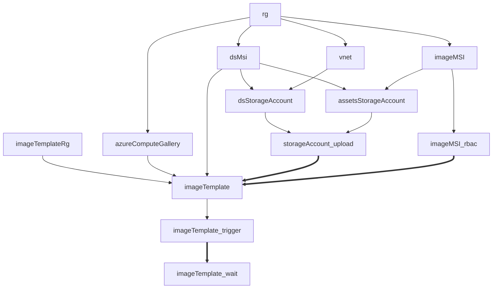
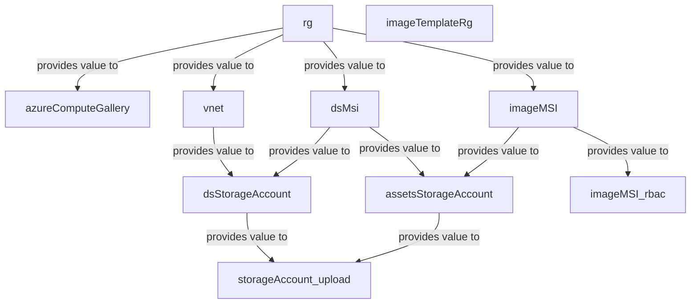
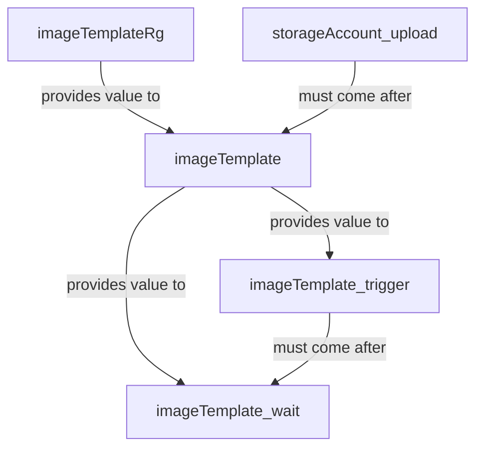
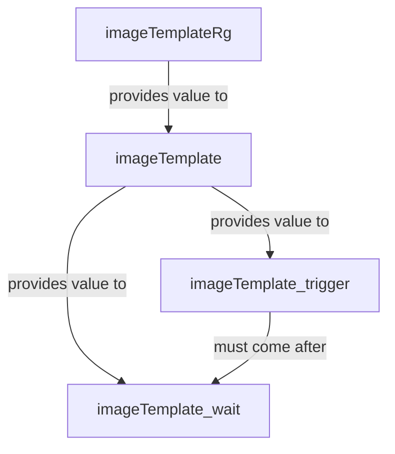

# Custom Images using Azure Image Builder `[VirtualMachineImages/AzureImageBuilder]`

This module provides you with a packaged solution to create custom images using the Azure Image Builder service publishing to an Azure Compute Gallery.

## Navigation

- [Resource Types](#Resource-Types)
- [Usage examples](#Usage-examples)
- [Parameters](#Parameters)
- [Outputs](#Outputs)
- [Cross-referenced modules](#Cross-referenced-modules)
- [Notes](#Notes)
- [Data Collection](#Data-Collection)

## Resource Types

| Resource Type | API Version |
| :-- | :-- |
| `Microsoft.Authorization/locks` | [2020-05-01](https://learn.microsoft.com/en-us/azure/templates/Microsoft.Authorization/2020-05-01/locks) |
| `Microsoft.Authorization/roleAssignments` | [2022-04-01](https://learn.microsoft.com/en-us/azure/templates/Microsoft.Authorization/2022-04-01/roleAssignments) |
| `Microsoft.Compute/galleries` | [2022-03-03](https://learn.microsoft.com/en-us/azure/templates/Microsoft.Compute/2022-03-03/galleries) |
| `Microsoft.Compute/galleries/applications` | [2022-03-03](https://learn.microsoft.com/en-us/azure/templates/Microsoft.Compute/2022-03-03/galleries/applications) |
| `Microsoft.Compute/galleries/images` | [2022-03-03](https://learn.microsoft.com/en-us/azure/templates/Microsoft.Compute/2022-03-03/galleries/images) |
| `Microsoft.Insights/diagnosticSettings` | [2021-05-01-preview](https://learn.microsoft.com/en-us/azure/templates/Microsoft.Insights/2021-05-01-preview/diagnosticSettings) |
| `Microsoft.ManagedIdentity/userAssignedIdentities` | [2023-01-31](https://learn.microsoft.com/en-us/azure/templates/Microsoft.ManagedIdentity/2023-01-31/userAssignedIdentities) |
| `Microsoft.ManagedIdentity/userAssignedIdentities/federatedIdentityCredentials` | [2023-01-31](https://learn.microsoft.com/en-us/azure/templates/Microsoft.ManagedIdentity/2023-01-31/userAssignedIdentities/federatedIdentityCredentials) |
| `Microsoft.Network/privateEndpoints` | [2023-04-01](https://learn.microsoft.com/en-us/azure/templates/Microsoft.Network/2023-04-01/privateEndpoints) |
| `Microsoft.Network/privateEndpoints/privateDnsZoneGroups` | [2023-04-01](https://learn.microsoft.com/en-us/azure/templates/Microsoft.Network/2023-04-01/privateEndpoints/privateDnsZoneGroups) |
| `Microsoft.Network/virtualNetworks` | [2023-04-01](https://learn.microsoft.com/en-us/azure/templates/Microsoft.Network/2023-04-01/virtualNetworks) |
| `Microsoft.Network/virtualNetworks/subnets` | [2023-04-01](https://learn.microsoft.com/en-us/azure/templates/Microsoft.Network/2023-04-01/virtualNetworks/subnets) |
| `Microsoft.Network/virtualNetworks/virtualNetworkPeerings` | [2023-04-01](https://learn.microsoft.com/en-us/azure/templates/Microsoft.Network/2023-04-01/virtualNetworks/virtualNetworkPeerings) |
| `Microsoft.Resources/deploymentScripts` | [2023-08-01](https://learn.microsoft.com/en-us/azure/templates/Microsoft.Resources/2023-08-01/deploymentScripts) |
| `Microsoft.Resources/resourceGroups` | [2024-03-01](https://learn.microsoft.com/en-us/azure/templates/Microsoft.Resources/2024-03-01/resourceGroups) |
| `Microsoft.Resources/resourceGroups` | [2021-04-01](https://learn.microsoft.com/en-us/azure/templates/Microsoft.Resources/2021-04-01/resourceGroups) |
| `Microsoft.Storage/storageAccounts` | [2022-09-01](https://learn.microsoft.com/en-us/azure/templates/Microsoft.Storage/2022-09-01/storageAccounts) |
| `Microsoft.Storage/storageAccounts/blobServices` | [2022-09-01](https://learn.microsoft.com/en-us/azure/templates/Microsoft.Storage/2022-09-01/storageAccounts/blobServices) |
| `Microsoft.Storage/storageAccounts/blobServices/containers` | [2022-09-01](https://learn.microsoft.com/en-us/azure/templates/Microsoft.Storage/2022-09-01/storageAccounts/blobServices/containers) |
| `Microsoft.Storage/storageAccounts/blobServices/containers/immutabilityPolicies` | [2022-09-01](https://learn.microsoft.com/en-us/azure/templates/Microsoft.Storage/2022-09-01/storageAccounts/blobServices/containers/immutabilityPolicies) |
| `Microsoft.Storage/storageAccounts/fileServices` | [2023-04-01](https://learn.microsoft.com/en-us/azure/templates/Microsoft.Storage/storageAccounts/fileServices) |
| `Microsoft.Storage/storageAccounts/fileServices/shares` | [2023-01-01](https://learn.microsoft.com/en-us/azure/templates/Microsoft.Storage/2023-01-01/storageAccounts/fileServices/shares) |
| `Microsoft.Storage/storageAccounts/localUsers` | [2023-04-01](https://learn.microsoft.com/en-us/azure/templates/Microsoft.Storage/storageAccounts/localUsers) |
| `Microsoft.Storage/storageAccounts/managementPolicies` | [2023-01-01](https://learn.microsoft.com/en-us/azure/templates/Microsoft.Storage/2023-01-01/storageAccounts/managementPolicies) |
| `Microsoft.Storage/storageAccounts/queueServices` | [2023-04-01](https://learn.microsoft.com/en-us/azure/templates/Microsoft.Storage/storageAccounts/queueServices) |
| `Microsoft.Storage/storageAccounts/queueServices/queues` | [2023-04-01](https://learn.microsoft.com/en-us/azure/templates/Microsoft.Storage/storageAccounts/queueServices/queues) |
| `Microsoft.Storage/storageAccounts/tableServices` | [2023-04-01](https://learn.microsoft.com/en-us/azure/templates/Microsoft.Storage/storageAccounts/tableServices) |
| `Microsoft.Storage/storageAccounts/tableServices/tables` | [2023-04-01](https://learn.microsoft.com/en-us/azure/templates/Microsoft.Storage/storageAccounts/tableServices/tables) |
| `Microsoft.VirtualMachineImages/imageTemplates` | [2023-07-01](https://learn.microsoft.com/en-us/azure/templates/Microsoft.VirtualMachineImages/imageTemplates) |

## Usage examples

The following section provides usage examples for the module, which were used to validate and deploy the module successfully. For a full reference, please review the module's test folder in its repository.

>**Note**: Each example lists all the required parameters first, followed by the rest - each in alphabetical order.

>**Note**: To reference the module, please use the following syntax `br/public:avm/ptn/virtual-machine-images/azure-image-builder:<version>`.

- [Using small parameter set](#example-1-using-small-parameter-set)
- [Creating a Linux image with Azure Image Builder](#example-2-creating-a-linux-image-with-azure-image-builder)
- [Deploying only the assets & image](#example-3-deploying-only-the-assets-image)
- [Deploying only the base services](#example-4-deploying-only-the-base-services)
- [Deploying only the image](#example-5-deploying-only-the-image)
- [Creating a Windows image with Azure Image Builder](#example-6-creating-a-windows-image-with-azure-image-builder)

### Example 1: _Using small parameter set_

This instance deploys the module with min features enabled.


<details>

<summary>via Bicep module</summary>

```bicep
module azureImageBuilder 'br/public:avm/ptn/virtual-machine-images/azure-image-builder:<version>' = {
  name: 'azureImageBuilderDeployment'
  params: {
    // Required parameters
    computeGalleryImageDefinitionName: '<computeGalleryImageDefinitionName>'
    computeGalleryImageDefinitions: [
      {
        hyperVGeneration: 'V2'
        name: 'sid-linux'
        offer: 'devops_linux'
        osType: 'Linux'
        publisher: 'devops'
        sku: 'devops_linux_az'
      }
    ]
    computeGalleryName: 'galapvmiaibl'
    imageTemplateImageSource: {
      offer: 'ubuntu-24_04-lts'
      publisher: 'canonical'
      sku: 'server'
      type: 'PlatformImage'
      version: 'latest'
    }
    // Non-required parameters
    deploymentsToPerform: '<deploymentsToPerform>'
    location: '<location>'
    resourceGroupName: '<resourceGroupName>'
  }
}
```

</details>
<p>

<details>

<summary>via JSON Parameter file</summary>

```json
{
  "$schema": "https://schema.management.azure.com/schemas/2019-04-01/deploymentParameters.json#",
  "contentVersion": "1.0.0.0",
  "parameters": {
    // Required parameters
    "computeGalleryImageDefinitionName": {
      "value": "<computeGalleryImageDefinitionName>"
    },
    "computeGalleryImageDefinitions": {
      "value": [
        {
          "hyperVGeneration": "V2",
          "name": "sid-linux",
          "offer": "devops_linux",
          "osType": "Linux",
          "publisher": "devops",
          "sku": "devops_linux_az"
        }
      ]
    },
    "computeGalleryName": {
      "value": "galapvmiaibl"
    },
    "imageTemplateImageSource": {
      "value": {
        "offer": "ubuntu-24_04-lts",
        "publisher": "canonical",
        "sku": "server",
        "type": "PlatformImage",
        "version": "latest"
      }
    },
    // Non-required parameters
    "deploymentsToPerform": {
      "value": "<deploymentsToPerform>"
    },
    "location": {
      "value": "<location>"
    },
    "resourceGroupName": {
      "value": "<resourceGroupName>"
    }
  }
}
```

</details>
<p>

### Example 2: _Creating a Linux image with Azure Image Builder_

This instance deploy a Linux-flavored image definition and image using Linux-specific installation scripts.


<details>

<summary>via Bicep module</summary>

```bicep
module azureImageBuilder 'br/public:avm/ptn/virtual-machine-images/azure-image-builder:<version>' = {
  name: 'azureImageBuilderDeployment'
  params: {
    // Required parameters
    computeGalleryImageDefinitionName: '<computeGalleryImageDefinitionName>'
    computeGalleryImageDefinitions: [
      {
        hyperVGeneration: 'V2'
        name: 'sid-linux'
        offer: 'devops_linux'
        osType: 'Linux'
        publisher: 'devops'
        sku: 'devops_linux_az'
      }
    ]
    computeGalleryName: 'galapvmiaibl'
    imageTemplateImageSource: {
      offer: 'ubuntu-24_04-lts'
      publisher: 'canonical'
      sku: 'server'
      type: 'PlatformImage'
      version: 'latest'
    }
    // Non-required parameters
    assetsStorageAccountContainerName: '<assetsStorageAccountContainerName>'
    assetsStorageAccountName: '<assetsStorageAccountName>'
    deploymentsToPerform: '<deploymentsToPerform>'
    imageTemplateCustomizationSteps: [
      {
        name: 'PowerShell installation'
        scriptUri: '<scriptUri>'
        type: 'Shell'
      }
      {
        destination: '<destination>'
        name: '<name>'
        sourceUri: '<sourceUri>'
        type: 'File'
      }
      {
        inline: [
          'pwsh \'<value>\''
        ]
        name: 'Software installation'
        type: 'Shell'
      }
    ]
    location: '<location>'
    resourceGroupName: '<resourceGroupName>'
    storageAccountFilesToUpload: {
      secureList: [
        {
          name: '<name>'
          value: '<value>'
        }
        {
          name: '<name>'
          value: '<value>'
        }
      ]
    }
  }
}
```

</details>
<p>

<details>

<summary>via JSON Parameter file</summary>

```json
{
  "$schema": "https://schema.management.azure.com/schemas/2019-04-01/deploymentParameters.json#",
  "contentVersion": "1.0.0.0",
  "parameters": {
    // Required parameters
    "computeGalleryImageDefinitionName": {
      "value": "<computeGalleryImageDefinitionName>"
    },
    "computeGalleryImageDefinitions": {
      "value": [
        {
          "hyperVGeneration": "V2",
          "name": "sid-linux",
          "offer": "devops_linux",
          "osType": "Linux",
          "publisher": "devops",
          "sku": "devops_linux_az"
        }
      ]
    },
    "computeGalleryName": {
      "value": "galapvmiaibl"
    },
    "imageTemplateImageSource": {
      "value": {
        "offer": "ubuntu-24_04-lts",
        "publisher": "canonical",
        "sku": "server",
        "type": "PlatformImage",
        "version": "latest"
      }
    },
    // Non-required parameters
    "assetsStorageAccountContainerName": {
      "value": "<assetsStorageAccountContainerName>"
    },
    "assetsStorageAccountName": {
      "value": "<assetsStorageAccountName>"
    },
    "deploymentsToPerform": {
      "value": "<deploymentsToPerform>"
    },
    "imageTemplateCustomizationSteps": {
      "value": [
        {
          "name": "PowerShell installation",
          "scriptUri": "<scriptUri>",
          "type": "Shell"
        },
        {
          "destination": "<destination>",
          "name": "<name>",
          "sourceUri": "<sourceUri>",
          "type": "File"
        },
        {
          "inline": [
            "pwsh \"<value>\""
          ],
          "name": "Software installation",
          "type": "Shell"
        }
      ]
    },
    "location": {
      "value": "<location>"
    },
    "resourceGroupName": {
      "value": "<resourceGroupName>"
    },
    "storageAccountFilesToUpload": {
      "value": {
        "secureList": [
          {
            "name": "<name>",
            "value": "<value>"
          },
          {
            "name": "<name>",
            "value": "<value>"
          }
        ]
      }
    }
  }
}
```

</details>
<p>

### Example 3: _Deploying only the assets & image_

This instance deploys the module with the conditions set up to only update the assets on the assets storage account and build the image, assuming all dependencies are setup.


<details>

<summary>via Bicep module</summary>

```bicep
module azureImageBuilder 'br/public:avm/ptn/virtual-machine-images/azure-image-builder:<version>' = {
  name: 'azureImageBuilderDeployment'
  params: {
    // Required parameters
    computeGalleryImageDefinitionName: '<computeGalleryImageDefinitionName>'
    computeGalleryImageDefinitions: '<computeGalleryImageDefinitions>'
    computeGalleryName: '<computeGalleryName>'
    imageTemplateImageSource: {
      offer: 'ubuntu-24_04-lts'
      publisher: 'canonical'
      sku: 'server'
      type: 'PlatformImage'
      version: 'latest'
    }
    // Non-required parameters
    assetsStorageAccountContainerName: '<assetsStorageAccountContainerName>'
    assetsStorageAccountName: '<assetsStorageAccountName>'
    deploymentScriptManagedIdentityName: '<deploymentScriptManagedIdentityName>'
    deploymentScriptStorageAccountName: '<deploymentScriptStorageAccountName>'
    deploymentScriptSubnetName: '<deploymentScriptSubnetName>'
    deploymentsToPerform: 'Only assets & image'
    imageManagedIdentityName: '<imageManagedIdentityName>'
    imageSubnetName: '<imageSubnetName>'
    imageTemplateCustomizationSteps: [
      {
        name: 'PowerShell installation'
        scriptUri: '<scriptUri>'
        type: 'Shell'
      }
    ]
    imageTemplateResourceGroupName: '<imageTemplateResourceGroupName>'
    location: '<location>'
    resourceGroupName: '<resourceGroupName>'
    storageAccountFilesToUpload: {
      secureList: [
        {
          name: '<name>'
          value: '<value>'
        }
      ]
    }
    virtualNetworkName: '<virtualNetworkName>'
  }
}
```

</details>
<p>

<details>

<summary>via JSON Parameter file</summary>

```json
{
  "$schema": "https://schema.management.azure.com/schemas/2019-04-01/deploymentParameters.json#",
  "contentVersion": "1.0.0.0",
  "parameters": {
    // Required parameters
    "computeGalleryImageDefinitionName": {
      "value": "<computeGalleryImageDefinitionName>"
    },
    "computeGalleryImageDefinitions": {
      "value": "<computeGalleryImageDefinitions>"
    },
    "computeGalleryName": {
      "value": "<computeGalleryName>"
    },
    "imageTemplateImageSource": {
      "value": {
        "offer": "ubuntu-24_04-lts",
        "publisher": "canonical",
        "sku": "server",
        "type": "PlatformImage",
        "version": "latest"
      }
    },
    // Non-required parameters
    "assetsStorageAccountContainerName": {
      "value": "<assetsStorageAccountContainerName>"
    },
    "assetsStorageAccountName": {
      "value": "<assetsStorageAccountName>"
    },
    "deploymentScriptManagedIdentityName": {
      "value": "<deploymentScriptManagedIdentityName>"
    },
    "deploymentScriptStorageAccountName": {
      "value": "<deploymentScriptStorageAccountName>"
    },
    "deploymentScriptSubnetName": {
      "value": "<deploymentScriptSubnetName>"
    },
    "deploymentsToPerform": {
      "value": "Only assets & image"
    },
    "imageManagedIdentityName": {
      "value": "<imageManagedIdentityName>"
    },
    "imageSubnetName": {
      "value": "<imageSubnetName>"
    },
    "imageTemplateCustomizationSteps": {
      "value": [
        {
          "name": "PowerShell installation",
          "scriptUri": "<scriptUri>",
          "type": "Shell"
        }
      ]
    },
    "imageTemplateResourceGroupName": {
      "value": "<imageTemplateResourceGroupName>"
    },
    "location": {
      "value": "<location>"
    },
    "resourceGroupName": {
      "value": "<resourceGroupName>"
    },
    "storageAccountFilesToUpload": {
      "value": {
        "secureList": [
          {
            "name": "<name>",
            "value": "<value>"
          }
        ]
      }
    },
    "virtualNetworkName": {
      "value": "<virtualNetworkName>"
    }
  }
}
```

</details>
<p>

### Example 4: _Deploying only the base services_

This instance deploys the module with the conditions set up to only deploy the base resources, that is everything but the image.


<details>

<summary>via Bicep module</summary>

```bicep
module azureImageBuilder 'br/public:avm/ptn/virtual-machine-images/azure-image-builder:<version>' = {
  name: 'azureImageBuilderDeployment'
  params: {
    // Required parameters
    computeGalleryImageDefinitionName: '<computeGalleryImageDefinitionName>'
    computeGalleryImageDefinitions: [
      {
        hyperVGeneration: 'V2'
        name: 'sid-linux'
        offer: 'devops_linux'
        osType: 'Linux'
        publisher: 'devops'
        sku: 'devops_linux_az'
      }
    ]
    computeGalleryName: 'galapvmiaibob'
    imageTemplateImageSource: {
      offer: 'ubuntu-24_04-lts'
      publisher: 'canonical'
      sku: 'server'
      type: 'PlatformImage'
      version: 'latest'
    }
    // Non-required parameters
    deploymentsToPerform: 'Only base'
    location: '<location>'
    resourceGroupName: '<resourceGroupName>'
  }
}
```

</details>
<p>

<details>

<summary>via JSON Parameter file</summary>

```json
{
  "$schema": "https://schema.management.azure.com/schemas/2019-04-01/deploymentParameters.json#",
  "contentVersion": "1.0.0.0",
  "parameters": {
    // Required parameters
    "computeGalleryImageDefinitionName": {
      "value": "<computeGalleryImageDefinitionName>"
    },
    "computeGalleryImageDefinitions": {
      "value": [
        {
          "hyperVGeneration": "V2",
          "name": "sid-linux",
          "offer": "devops_linux",
          "osType": "Linux",
          "publisher": "devops",
          "sku": "devops_linux_az"
        }
      ]
    },
    "computeGalleryName": {
      "value": "galapvmiaibob"
    },
    "imageTemplateImageSource": {
      "value": {
        "offer": "ubuntu-24_04-lts",
        "publisher": "canonical",
        "sku": "server",
        "type": "PlatformImage",
        "version": "latest"
      }
    },
    // Non-required parameters
    "deploymentsToPerform": {
      "value": "Only base"
    },
    "location": {
      "value": "<location>"
    },
    "resourceGroupName": {
      "value": "<resourceGroupName>"
    }
  }
}
```

</details>
<p>

### Example 5: _Deploying only the image_

This instance deploys the module with the conditions set up to only deploy and bake the image, assuming all dependencies are setup.


<details>

<summary>via Bicep module</summary>

```bicep
module azureImageBuilder 'br/public:avm/ptn/virtual-machine-images/azure-image-builder:<version>' = {
  name: 'azureImageBuilderDeployment'
  params: {
    // Required parameters
    computeGalleryImageDefinitionName: '<computeGalleryImageDefinitionName>'
    computeGalleryImageDefinitions: '<computeGalleryImageDefinitions>'
    computeGalleryName: '<computeGalleryName>'
    imageTemplateImageSource: {
      offer: 'ubuntu-24_04-lts'
      publisher: 'canonical'
      sku: 'server'
      type: 'PlatformImage'
      version: 'latest'
    }
    // Non-required parameters
    deploymentScriptManagedIdentityName: '<deploymentScriptManagedIdentityName>'
    deploymentScriptStorageAccountName: '<deploymentScriptStorageAccountName>'
    deploymentScriptSubnetName: '<deploymentScriptSubnetName>'
    deploymentsToPerform: 'Only image'
    imageManagedIdentityName: '<imageManagedIdentityName>'
    imageSubnetName: '<imageSubnetName>'
    imageTemplateCustomizationSteps: [
      {
        name: 'PowerShell installation'
        scriptUri: '<scriptUri>'
        type: 'Shell'
      }
    ]
    imageTemplateResourceGroupName: '<imageTemplateResourceGroupName>'
    location: '<location>'
    resourceGroupName: '<resourceGroupName>'
    virtualNetworkName: '<virtualNetworkName>'
  }
}
```

</details>
<p>

<details>

<summary>via JSON Parameter file</summary>

```json
{
  "$schema": "https://schema.management.azure.com/schemas/2019-04-01/deploymentParameters.json#",
  "contentVersion": "1.0.0.0",
  "parameters": {
    // Required parameters
    "computeGalleryImageDefinitionName": {
      "value": "<computeGalleryImageDefinitionName>"
    },
    "computeGalleryImageDefinitions": {
      "value": "<computeGalleryImageDefinitions>"
    },
    "computeGalleryName": {
      "value": "<computeGalleryName>"
    },
    "imageTemplateImageSource": {
      "value": {
        "offer": "ubuntu-24_04-lts",
        "publisher": "canonical",
        "sku": "server",
        "type": "PlatformImage",
        "version": "latest"
      }
    },
    // Non-required parameters
    "deploymentScriptManagedIdentityName": {
      "value": "<deploymentScriptManagedIdentityName>"
    },
    "deploymentScriptStorageAccountName": {
      "value": "<deploymentScriptStorageAccountName>"
    },
    "deploymentScriptSubnetName": {
      "value": "<deploymentScriptSubnetName>"
    },
    "deploymentsToPerform": {
      "value": "Only image"
    },
    "imageManagedIdentityName": {
      "value": "<imageManagedIdentityName>"
    },
    "imageSubnetName": {
      "value": "<imageSubnetName>"
    },
    "imageTemplateCustomizationSteps": {
      "value": [
        {
          "name": "PowerShell installation",
          "scriptUri": "<scriptUri>",
          "type": "Shell"
        }
      ]
    },
    "imageTemplateResourceGroupName": {
      "value": "<imageTemplateResourceGroupName>"
    },
    "location": {
      "value": "<location>"
    },
    "resourceGroupName": {
      "value": "<resourceGroupName>"
    },
    "virtualNetworkName": {
      "value": "<virtualNetworkName>"
    }
  }
}
```

</details>
<p>

### Example 6: _Creating a Windows image with Azure Image Builder_

This instance deploy a Windows-flavored image definition and image using Windows-specific installation scripts.


<details>

<summary>via Bicep module</summary>

```bicep
module azureImageBuilder 'br/public:avm/ptn/virtual-machine-images/azure-image-builder:<version>' = {
  name: 'azureImageBuilderDeployment'
  params: {
    // Required parameters
    computeGalleryImageDefinitionName: '<computeGalleryImageDefinitionName>'
    computeGalleryImageDefinitions: [
      {
        name: '<name>'
        offer: 'devops_windows'
        osType: 'Windows'
        publisher: 'devops'
        sku: 'devops_windows_az'
      }
    ]
    computeGalleryName: 'galapvmiaibw'
    imageTemplateImageSource: {
      offer: 'Windows-10'
      publisher: 'MicrosoftWindowsDesktop'
      sku: '19h2-evd'
      type: 'PlatformImage'
      version: 'latest'
    }
    // Non-required parameters
    assetsStorageAccountContainerName: '<assetsStorageAccountContainerName>'
    assetsStorageAccountName: '<assetsStorageAccountName>'
    deploymentsToPerform: '<deploymentsToPerform>'
    imageTemplateCustomizationSteps: [
      {
        inline: [
          '. \'<value>\''
          'wget \'https://<value>\''
          'Write-Output \'Download\''
          'Write-Output \'Invocation\''
        ]
        name: 'PowerShell installation'
        runElevated: true
        type: 'PowerShell'
      }
      {
        destination: '<destination>'
        name: '<name>'
        sourceUri: '<sourceUri>'
        type: 'File'
      }
      {
        inline: [
          'pwsh \'<value>\''
          'wget \'https://<value>\''
        ]
        name: 'Software installation'
        runElevated: true
        type: 'PowerShell'
      }
    ]
    location: '<location>'
    resourceGroupName: '<resourceGroupName>'
    storageAccountFilesToUpload: {
      secureList: [
        {
          name: '<name>'
          value: '<value>'
        }
        {
          name: '<name>'
          value: '<value>'
        }
      ]
    }
  }
}
```

</details>
<p>

<details>

<summary>via JSON Parameter file</summary>

```json
{
  "$schema": "https://schema.management.azure.com/schemas/2019-04-01/deploymentParameters.json#",
  "contentVersion": "1.0.0.0",
  "parameters": {
    // Required parameters
    "computeGalleryImageDefinitionName": {
      "value": "<computeGalleryImageDefinitionName>"
    },
    "computeGalleryImageDefinitions": {
      "value": [
        {
          "name": "<name>",
          "offer": "devops_windows",
          "osType": "Windows",
          "publisher": "devops",
          "sku": "devops_windows_az"
        }
      ]
    },
    "computeGalleryName": {
      "value": "galapvmiaibw"
    },
    "imageTemplateImageSource": {
      "value": {
        "offer": "Windows-10",
        "publisher": "MicrosoftWindowsDesktop",
        "sku": "19h2-evd",
        "type": "PlatformImage",
        "version": "latest"
      }
    },
    // Non-required parameters
    "assetsStorageAccountContainerName": {
      "value": "<assetsStorageAccountContainerName>"
    },
    "assetsStorageAccountName": {
      "value": "<assetsStorageAccountName>"
    },
    "deploymentsToPerform": {
      "value": "<deploymentsToPerform>"
    },
    "imageTemplateCustomizationSteps": {
      "value": [
        {
          "inline": [
            ". \"<value>\"",
            "wget \"https://<value>\"",
            "Write-Output \"Download\"",
            "Write-Output \"Invocation\""
          ],
          "name": "PowerShell installation",
          "runElevated": true,
          "type": "PowerShell"
        },
        {
          "destination": "<destination>",
          "name": "<name>",
          "sourceUri": "<sourceUri>",
          "type": "File"
        },
        {
          "inline": [
            "pwsh \"<value>\"",
            "wget \"https://<value>\""
          ],
          "name": "Software installation",
          "runElevated": true,
          "type": "PowerShell"
        }
      ]
    },
    "location": {
      "value": "<location>"
    },
    "resourceGroupName": {
      "value": "<resourceGroupName>"
    },
    "storageAccountFilesToUpload": {
      "value": {
        "secureList": [
          {
            "name": "<name>",
            "value": "<value>"
          },
          {
            "name": "<name>",
            "value": "<value>"
          }
        ]
      }
    }
  }
}
```

</details>
<p>


## Parameters

**Required parameters**

| Parameter | Type | Description |
| :-- | :-- | :-- |
| [`computeGalleryImageDefinitionName`](#parameter-computegalleryimagedefinitionname) | string | The name of Image Definition of the Azure Compute Gallery to host the new image version. |
| [`computeGalleryImageDefinitions`](#parameter-computegalleryimagedefinitions) | array | The Image Definitions in the Azure Compute Gallery. |
| [`computeGalleryName`](#parameter-computegalleryname) | string | The name of the Azure Compute Gallery. |
| [`imageTemplateImageSource`](#parameter-imagetemplateimagesource) | object | The image source to use for the Image Template. |

**Optional parameters**

| Parameter | Type | Description |
| :-- | :-- | :-- |
| [`assetsStorageAccountContainerName`](#parameter-assetsstorageaccountcontainername) | string | The name of container in the Storage Account. |
| [`assetsStorageAccountName`](#parameter-assetsstorageaccountname) | string | The name of the storage account. Only needed if you want to upload scripts to be used during image baking. |
| [`deploymentScriptManagedIdentityName`](#parameter-deploymentscriptmanagedidentityname) | string | The name of the Managed Identity used by deployment scripts. |
| [`deploymentScriptStorageAccountName`](#parameter-deploymentscriptstorageaccountname) | string | The name of the storage account. |
| [`deploymentScriptSubnetName`](#parameter-deploymentscriptsubnetname) | string | The name of the Image Template Virtual Network Subnet to create. |
| [`deploymentsToPerform`](#parameter-deploymentstoperform) | string | A parameter to control which deployments should be executed. |
| [`enableTelemetry`](#parameter-enabletelemetry) | bool | Enable/Disable usage telemetry for module. |
| [`imageManagedIdentityName`](#parameter-imagemanagedidentityname) | string | The name of the Managed Identity used by the Azure Image Builder. |
| [`imageSubnetName`](#parameter-imagesubnetname) | string | The name of the Image Template Virtual Network Subnet to create. |
| [`imageTemplateCustomizationSteps`](#parameter-imagetemplatecustomizationsteps) | array | The customization steps to use for the Image Template. |
| [`imageTemplateDeploymentScriptName`](#parameter-imagetemplatedeploymentscriptname) | string | The name of the Deployment Script to trigger the image template baking. |
| [`imageTemplateName`](#parameter-imagetemplatename) | string | The name of the Image Template. |
| [`imageTemplateResourceGroupName`](#parameter-imagetemplateresourcegroupname) | string | The name of the Resource Group to deploy the Image Template resources into. |
| [`location`](#parameter-location) | string | The location to deploy into. |
| [`resourceGroupName`](#parameter-resourcegroupname) | string | The name of the Resource Group. |
| [`storageAccountFilesToUpload`](#parameter-storageaccountfilestoupload) | object | The files to upload to the Assets Storage Account. The syntax of each item should be like: { name: 'script_Install-LinuxPowerShell_sh' <p> value: loadTextContent('../scripts/uploads/linux/Install-LinuxPowerShell.sh') }. |
| [`storageDeploymentScriptName`](#parameter-storagedeploymentscriptname) | string | The name of the Deployment Script to trigger the Image Template baking. |
| [`virtualNetworkAddressPrefix`](#parameter-virtualnetworkaddressprefix) | string | The address space of the Virtual Network. |
| [`virtualNetworkDeploymentScriptSubnetAddressPrefix`](#parameter-virtualnetworkdeploymentscriptsubnetaddressprefix) | string | The address space of the Virtual Network Subnet used by the deployment script. |
| [`virtualNetworkName`](#parameter-virtualnetworkname) | string | The name of the Virtual Network. |
| [`virtualNetworkSubnetAddressPrefix`](#parameter-virtualnetworksubnetaddressprefix) | string | The address space of the Virtual Network Subnet. |
| [`waitDeploymentScriptName`](#parameter-waitdeploymentscriptname) | string | The name of the Deployment Script to wait for the the image template baking. |
| [`waitForImageBuild`](#parameter-waitforimagebuild) | bool | A parameter to control if the deployment should wait for the image build to complete. |

**Generated parameters**

| Parameter | Type | Description |
| :-- | :-- | :-- |
| [`baseTime`](#parameter-basetime) | string | Do not provide a value! This date value is used to generate a SAS token to access the modules. |

### Parameter: `computeGalleryImageDefinitionName`

The name of Image Definition of the Azure Compute Gallery to host the new image version.

- Required: Yes
- Type: string

### Parameter: `computeGalleryImageDefinitions`

The Image Definitions in the Azure Compute Gallery.

- Required: Yes
- Type: array

### Parameter: `computeGalleryName`

The name of the Azure Compute Gallery.

- Required: Yes
- Type: string

### Parameter: `imageTemplateImageSource`

The image source to use for the Image Template.

- Required: Yes
- Type: object

### Parameter: `assetsStorageAccountContainerName`

The name of container in the Storage Account.

- Required: No
- Type: string
- Default: `'aibscripts'`

### Parameter: `assetsStorageAccountName`

The name of the storage account. Only needed if you want to upload scripts to be used during image baking.

- Required: No
- Type: string

### Parameter: `deploymentScriptManagedIdentityName`

The name of the Managed Identity used by deployment scripts.

- Required: No
- Type: string
- Default: `'msi-ds'`

### Parameter: `deploymentScriptStorageAccountName`

The name of the storage account.

- Required: No
- Type: string
- Default: `[format('{0}ds', parameters('assetsStorageAccountName'))]`

### Parameter: `deploymentScriptSubnetName`

The name of the Image Template Virtual Network Subnet to create.

- Required: No
- Type: string
- Default: `'subnet-ds'`

### Parameter: `deploymentsToPerform`

A parameter to control which deployments should be executed.

- Required: No
- Type: string
- Default: `'Only assets & image'`
- Allowed:
  ```Bicep
  [
    'All'
    'Only assets & image'
    'Only base'
    'Only image'
  ]
  ```

### Parameter: `enableTelemetry`

Enable/Disable usage telemetry for module.

- Required: No
- Type: bool
- Default: `True`

### Parameter: `imageManagedIdentityName`

The name of the Managed Identity used by the Azure Image Builder.

- Required: No
- Type: string
- Default: `'msi-aib'`

### Parameter: `imageSubnetName`

The name of the Image Template Virtual Network Subnet to create.

- Required: No
- Type: string
- Default: `'subnet-it'`

### Parameter: `imageTemplateCustomizationSteps`

The customization steps to use for the Image Template.

- Required: No
- Type: array

### Parameter: `imageTemplateDeploymentScriptName`

The name of the Deployment Script to trigger the image template baking.

- Required: No
- Type: string
- Default: `'ds-triggerBuild-imageTemplate'`

### Parameter: `imageTemplateName`

The name of the Image Template.

- Required: No
- Type: string
- Default: `'it-aib'`

### Parameter: `imageTemplateResourceGroupName`

The name of the Resource Group to deploy the Image Template resources into.

- Required: No
- Type: string
- Default: `[format('{0}-image-build', parameters('resourceGroupName'))]`

### Parameter: `location`

The location to deploy into.

- Required: No
- Type: string
- Default: `[deployment().location]`

### Parameter: `resourceGroupName`

The name of the Resource Group.

- Required: No
- Type: string
- Default: `'rg-ado-agents'`

### Parameter: `storageAccountFilesToUpload`

The files to upload to the Assets Storage Account. The syntax of each item should be like: { name: 'script_Install-LinuxPowerShell_sh' <p> value: loadTextContent('../scripts/uploads/linux/Install-LinuxPowerShell.sh') }.

- Required: No
- Type: object
- Default: `{}`

### Parameter: `storageDeploymentScriptName`

The name of the Deployment Script to trigger the Image Template baking.

- Required: No
- Type: string
- Default: `'ds-triggerUpload-storage'`

### Parameter: `virtualNetworkAddressPrefix`

The address space of the Virtual Network.

- Required: No
- Type: string
- Default: `'10.0.0.0/16'`

### Parameter: `virtualNetworkDeploymentScriptSubnetAddressPrefix`

The address space of the Virtual Network Subnet used by the deployment script.

- Required: No
- Type: string
- Default: `[cidrSubnet(parameters('virtualNetworkAddressPrefix'), 24, 1)]`

### Parameter: `virtualNetworkName`

The name of the Virtual Network.

- Required: No
- Type: string
- Default: `'vnet-it'`

### Parameter: `virtualNetworkSubnetAddressPrefix`

The address space of the Virtual Network Subnet.

- Required: No
- Type: string
- Default: `[cidrSubnet(parameters('virtualNetworkAddressPrefix'), 24, 0)]`

### Parameter: `waitDeploymentScriptName`

The name of the Deployment Script to wait for the the image template baking.

- Required: No
- Type: string
- Default: `'ds-wait-imageTemplate-build'`

### Parameter: `waitForImageBuild`

A parameter to control if the deployment should wait for the image build to complete.

- Required: No
- Type: bool
- Default: `True`

### Parameter: `baseTime`

Do not provide a value! This date value is used to generate a SAS token to access the modules.

- Required: No
- Type: string
- Default: `[utcNow()]`


## Outputs

| Output | Type |
| :-- | :-- |

## Cross-referenced modules

This section gives you an overview of all local-referenced module files (i.e., other modules that are referenced in this module) and all remote-referenced files (i.e., Bicep modules that are referenced from a Bicep Registry or Template Specs).

| Reference | Type |
| :-- | :-- |
| `br/public:avm/res/compute/gallery:0.4.0` | Remote reference |
| `br/public:avm/res/managed-identity/user-assigned-identity:0.2.2` | Remote reference |
| `br/public:avm/res/network/virtual-network:0.1.6` | Remote reference |
| `br/public:avm/res/resources/deployment-script:0.2.4` | Remote reference |
| `br/public:avm/res/resources/resource-group:0.2.4` | Remote reference |
| `br/public:avm/res/storage/storage-account:0.9.1` | Remote reference |
| `br/public:avm/res/virtual-machine-images/image-template:0.2.1` | Remote reference |

## Notes

# (Simplified) All



# (Simplified) Only base


# Only assets & image
Assumes all other services + permissions are deployed


# Only image
Assumes all other services + permissions are deployed


## Data Collection

The software may collect information about you and your use of the software and send it to Microsoft. Microsoft may use this information to provide services and improve our products and services. You may turn off the telemetry as described in the [repository](https://aka.ms/avm/telemetry). There are also some features in the software that may enable you and Microsoft to collect data from users of your applications. If you use these features, you must comply with applicable law, including providing appropriate notices to users of your applications together with a copy of Microsoft’s privacy statement. Our privacy statement is located at <https://go.microsoft.com/fwlink/?LinkID=824704>. You can learn more about data collection and use in the help documentation and our privacy statement. Your use of the software operates as your consent to these practices.
