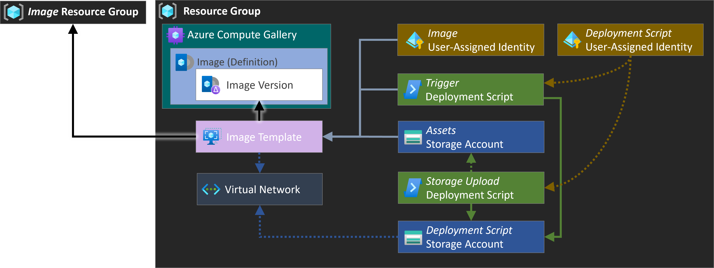

# Custom Images using Azure Image Builder `[VirtualMachineImages/AzureImageBuilder]`

This module provides you with a packaged solution to create custom images using the Azure Image Builder service publishing to an Azure Compute Gallery.

## Navigation

- [Resource Types](#Resource-Types)
- [Usage examples](#Usage-examples)
- [Parameters](#Parameters)
- [Outputs](#Outputs)
- [Cross-referenced modules](#Cross-referenced-modules)
- [Notes](#Notes)
- [Data Collection](#Data-Collection)

## Resource Types

| Resource Type | API Version |
| :-- | :-- |
| `Microsoft.Authorization/locks` | [2020-05-01](https://learn.microsoft.com/en-us/azure/templates/Microsoft.Authorization/2020-05-01/locks) |
| `Microsoft.Authorization/roleAssignments` | [2022-04-01](https://learn.microsoft.com/en-us/azure/templates/Microsoft.Authorization/2022-04-01/roleAssignments) |
| `Microsoft.Compute/galleries` | [2023-07-03](https://learn.microsoft.com/en-us/azure/templates/Microsoft.Compute/2023-07-03/galleries) |
| `Microsoft.Compute/galleries/applications` | [2022-03-03](https://learn.microsoft.com/en-us/azure/templates/Microsoft.Compute/2022-03-03/galleries/applications) |
| `Microsoft.Compute/galleries/images` | [2023-07-03](https://learn.microsoft.com/en-us/azure/templates/Microsoft.Compute/2023-07-03/galleries/images) |
| `Microsoft.Insights/diagnosticSettings` | [2021-05-01-preview](https://learn.microsoft.com/en-us/azure/templates/Microsoft.Insights/2021-05-01-preview/diagnosticSettings) |
| `Microsoft.KeyVault/vaults/secrets` | [2023-07-01](https://learn.microsoft.com/en-us/azure/templates/Microsoft.KeyVault/2023-07-01/vaults/secrets) |
| `Microsoft.ManagedIdentity/userAssignedIdentities` | [2023-01-31](https://learn.microsoft.com/en-us/azure/templates/Microsoft.ManagedIdentity/2023-01-31/userAssignedIdentities) |
| `Microsoft.ManagedIdentity/userAssignedIdentities/federatedIdentityCredentials` | [2023-01-31](https://learn.microsoft.com/en-us/azure/templates/Microsoft.ManagedIdentity/2023-01-31/userAssignedIdentities/federatedIdentityCredentials) |
| `Microsoft.Network/privateEndpoints` | [2023-11-01](https://learn.microsoft.com/en-us/azure/templates/Microsoft.Network/2023-11-01/privateEndpoints) |
| `Microsoft.Network/privateEndpoints/privateDnsZoneGroups` | [2023-11-01](https://learn.microsoft.com/en-us/azure/templates/Microsoft.Network/2023-11-01/privateEndpoints/privateDnsZoneGroups) |
| `Microsoft.Network/virtualNetworks` | [2024-01-01](https://learn.microsoft.com/en-us/azure/templates/Microsoft.Network/2024-01-01/virtualNetworks) |
| `Microsoft.Network/virtualNetworks/subnets` | [2024-01-01](https://learn.microsoft.com/en-us/azure/templates/Microsoft.Network/2024-01-01/virtualNetworks/subnets) |
| `Microsoft.Network/virtualNetworks/virtualNetworkPeerings` | [2024-01-01](https://learn.microsoft.com/en-us/azure/templates/Microsoft.Network/2024-01-01/virtualNetworks/virtualNetworkPeerings) |
| `Microsoft.Resources/deploymentScripts` | [2023-08-01](https://learn.microsoft.com/en-us/azure/templates/Microsoft.Resources/2023-08-01/deploymentScripts) |
| `Microsoft.Resources/resourceGroups` | [2024-03-01](https://learn.microsoft.com/en-us/azure/templates/Microsoft.Resources/2024-03-01/resourceGroups) |
| `Microsoft.Resources/resourceGroups` | [2021-04-01](https://learn.microsoft.com/en-us/azure/templates/Microsoft.Resources/2021-04-01/resourceGroups) |
| `Microsoft.Storage/storageAccounts` | [2023-05-01](https://learn.microsoft.com/en-us/azure/templates/Microsoft.Storage/2023-05-01/storageAccounts) |
| `Microsoft.Storage/storageAccounts/blobServices` | [2022-09-01](https://learn.microsoft.com/en-us/azure/templates/Microsoft.Storage/2022-09-01/storageAccounts/blobServices) |
| `Microsoft.Storage/storageAccounts/blobServices/containers` | [2022-09-01](https://learn.microsoft.com/en-us/azure/templates/Microsoft.Storage/2022-09-01/storageAccounts/blobServices/containers) |
| `Microsoft.Storage/storageAccounts/blobServices/containers/immutabilityPolicies` | [2022-09-01](https://learn.microsoft.com/en-us/azure/templates/Microsoft.Storage/2022-09-01/storageAccounts/blobServices/containers/immutabilityPolicies) |
| `Microsoft.Storage/storageAccounts/fileServices` | [2023-04-01](https://learn.microsoft.com/en-us/azure/templates/Microsoft.Storage/2023-04-01/storageAccounts/fileServices) |
| `Microsoft.Storage/storageAccounts/fileServices/shares` | [2023-01-01](https://learn.microsoft.com/en-us/azure/templates/Microsoft.Storage/2023-01-01/storageAccounts/fileServices/shares) |
| `Microsoft.Storage/storageAccounts/localUsers` | [2023-04-01](https://learn.microsoft.com/en-us/azure/templates/Microsoft.Storage/2023-04-01/storageAccounts/localUsers) |
| `Microsoft.Storage/storageAccounts/managementPolicies` | [2023-01-01](https://learn.microsoft.com/en-us/azure/templates/Microsoft.Storage/2023-01-01/storageAccounts/managementPolicies) |
| `Microsoft.Storage/storageAccounts/queueServices` | [2023-04-01](https://learn.microsoft.com/en-us/azure/templates/Microsoft.Storage/2023-04-01/storageAccounts/queueServices) |
| `Microsoft.Storage/storageAccounts/queueServices/queues` | [2023-04-01](https://learn.microsoft.com/en-us/azure/templates/Microsoft.Storage/2023-04-01/storageAccounts/queueServices/queues) |
| `Microsoft.Storage/storageAccounts/tableServices` | [2023-04-01](https://learn.microsoft.com/en-us/azure/templates/Microsoft.Storage/2023-04-01/storageAccounts/tableServices) |
| `Microsoft.Storage/storageAccounts/tableServices/tables` | [2023-04-01](https://learn.microsoft.com/en-us/azure/templates/Microsoft.Storage/2023-04-01/storageAccounts/tableServices/tables) |
| `Microsoft.VirtualMachineImages/imageTemplates` | [2023-07-01](https://learn.microsoft.com/en-us/azure/templates/Microsoft.VirtualMachineImages/2023-07-01/imageTemplates) |

## Usage examples

The following section provides usage examples for the module, which were used to validate and deploy the module successfully. For a full reference, please review the module's test folder in its repository.

>**Note**: Each example lists all the required parameters first, followed by the rest - each in alphabetical order.

>**Note**: To reference the module, please use the following syntax `br/public:avm/ptn/virtual-machine-images/azure-image-builder:<version>`.

- [Using small parameter set](#example-1-using-small-parameter-set)
- [Deploying full solution for Linux](#example-2-deploying-full-solution-for-linux)
- [Deploying full solution for Windows](#example-3-deploying-full-solution-for-windows)
- [Deploying only the assets & image](#example-4-deploying-only-the-assets-image)
- [Deploying only the base services](#example-5-deploying-only-the-base-services)
- [Deploying only the image](#example-6-deploying-only-the-image)

### Example 1: _Using small parameter set_

This instance deploys the module with min features enabled.


<details>

<summary>via Bicep module</summary>

```bicep
module azureImageBuilder 'br/public:avm/ptn/virtual-machine-images/azure-image-builder:<version>' = {
  name: 'azureImageBuilderDeployment'
  params: {
    // Required parameters
    computeGalleryImageDefinitionName: '<computeGalleryImageDefinitionName>'
    computeGalleryImageDefinitions: [
      {
        hyperVGeneration: 'V2'
        identifier: {
          offer: 'devops_linux'
          publisher: 'devops'
          sku: 'devops_linux_az'
        }
        name: 'sid-linux'
        osState: 'Generalized'
        osType: 'Linux'
      }
    ]
    computeGalleryName: 'galapvmiaibmin'
    imageTemplateImageSource: {
      offer: 'ubuntu-24_04-lts'
      publisher: 'canonical'
      sku: 'server'
      type: 'PlatformImage'
      version: 'latest'
    }
    // Non-required parameters
    assetsStorageAccountName: 'stapvmiaibmin'
    deploymentsToPerform: '<deploymentsToPerform>'
    location: '<location>'
    resourceGroupName: '<resourceGroupName>'
  }
}
```

</details>
<p>

<details>

<summary>via JSON parameters file</summary>

```json
{
  "$schema": "https://schema.management.azure.com/schemas/2019-04-01/deploymentParameters.json#",
  "contentVersion": "1.0.0.0",
  "parameters": {
    // Required parameters
    "computeGalleryImageDefinitionName": {
      "value": "<computeGalleryImageDefinitionName>"
    },
    "computeGalleryImageDefinitions": {
      "value": [
        {
          "hyperVGeneration": "V2",
          "identifier": {
            "offer": "devops_linux",
            "publisher": "devops",
            "sku": "devops_linux_az"
          },
          "name": "sid-linux",
          "osState": "Generalized",
          "osType": "Linux"
        }
      ]
    },
    "computeGalleryName": {
      "value": "galapvmiaibmin"
    },
    "imageTemplateImageSource": {
      "value": {
        "offer": "ubuntu-24_04-lts",
        "publisher": "canonical",
        "sku": "server",
        "type": "PlatformImage",
        "version": "latest"
      }
    },
    // Non-required parameters
    "assetsStorageAccountName": {
      "value": "stapvmiaibmin"
    },
    "deploymentsToPerform": {
      "value": "<deploymentsToPerform>"
    },
    "location": {
      "value": "<location>"
    },
    "resourceGroupName": {
      "value": "<resourceGroupName>"
    }
  }
}
```

</details>
<p>

<details>

<summary>via Bicep parameters file</summary>

```bicep-params
using 'br/public:avm/ptn/virtual-machine-images/azure-image-builder:<version>'

// Required parameters
param computeGalleryImageDefinitionName = '<computeGalleryImageDefinitionName>'
param computeGalleryImageDefinitions = [
  {
    hyperVGeneration: 'V2'
    identifier: {
      offer: 'devops_linux'
      publisher: 'devops'
      sku: 'devops_linux_az'
    }
    name: 'sid-linux'
    osState: 'Generalized'
    osType: 'Linux'
  }
]
param computeGalleryName = 'galapvmiaibmin'
param imageTemplateImageSource = {
  offer: 'ubuntu-24_04-lts'
  publisher: 'canonical'
  sku: 'server'
  type: 'PlatformImage'
  version: 'latest'
}
// Non-required parameters
param assetsStorageAccountName = 'stapvmiaibmin'
param deploymentsToPerform = '<deploymentsToPerform>'
param location = '<location>'
param resourceGroupName = '<resourceGroupName>'
```

</details>
<p>

### Example 2: _Deploying full solution for Linux_

This instance deploys the module with the conditions set up to deploy all resource and build a Linux image.


<details>

<summary>via Bicep module</summary>

```bicep
module azureImageBuilder 'br/public:avm/ptn/virtual-machine-images/azure-image-builder:<version>' = {
  name: 'azureImageBuilderDeployment'
  params: {
    // Required parameters
    computeGalleryImageDefinitionName: '<computeGalleryImageDefinitionName>'
    computeGalleryImageDefinitions: [
      {
        hyperVGeneration: 'V2'
        identifier: {
          offer: 'devops_linux'
          publisher: 'devops'
          sku: 'devops_linux_az'
        }
        name: '<name>'
        osState: 'Generalized'
        osType: 'Linux'
      }
    ]
    computeGalleryName: 'galapvmiaibal'
    imageTemplateImageSource: {
      offer: '0001-com-ubuntu-server-jammy'
      publisher: 'canonical'
      sku: '22_04-lts-gen2'
      type: 'PlatformImage'
      version: 'latest'
    }
    // Non-required parameters
    assetsStorageAccountContainerName: '<assetsStorageAccountContainerName>'
    assetsStorageAccountName: '<assetsStorageAccountName>'
    deploymentsToPerform: '<deploymentsToPerform>'
    imageTemplateCustomizationSteps: [
      {
        name: 'PowerShell Core installation'
        scriptUri: '<scriptUri>'
        type: 'Shell'
      }
      {
        destination: '<destination>'
        name: '<name>'
        sourceUri: '<sourceUri>'
        type: 'File'
      }
      {
        inline: [
          'pwsh \'<value>\''
        ]
        name: 'Software installation'
        type: 'Shell'
      }
    ]
    location: '<location>'
    resourceGroupName: '<resourceGroupName>'
    storageAccountFilesToUpload: [
      {
        name: '<name>'
        value: '<value>'
      }
      {
        name: '<name>'
        value: '<value>'
      }
    ]
  }
}
```

</details>
<p>

<details>

<summary>via JSON parameters file</summary>

```json
{
  "$schema": "https://schema.management.azure.com/schemas/2019-04-01/deploymentParameters.json#",
  "contentVersion": "1.0.0.0",
  "parameters": {
    // Required parameters
    "computeGalleryImageDefinitionName": {
      "value": "<computeGalleryImageDefinitionName>"
    },
    "computeGalleryImageDefinitions": {
      "value": [
        {
          "hyperVGeneration": "V2",
          "identifier": {
            "offer": "devops_linux",
            "publisher": "devops",
            "sku": "devops_linux_az"
          },
          "name": "<name>",
          "osState": "Generalized",
          "osType": "Linux"
        }
      ]
    },
    "computeGalleryName": {
      "value": "galapvmiaibal"
    },
    "imageTemplateImageSource": {
      "value": {
        "offer": "0001-com-ubuntu-server-jammy",
        "publisher": "canonical",
        "sku": "22_04-lts-gen2",
        "type": "PlatformImage",
        "version": "latest"
      }
    },
    // Non-required parameters
    "assetsStorageAccountContainerName": {
      "value": "<assetsStorageAccountContainerName>"
    },
    "assetsStorageAccountName": {
      "value": "<assetsStorageAccountName>"
    },
    "deploymentsToPerform": {
      "value": "<deploymentsToPerform>"
    },
    "imageTemplateCustomizationSteps": {
      "value": [
        {
          "name": "PowerShell Core installation",
          "scriptUri": "<scriptUri>",
          "type": "Shell"
        },
        {
          "destination": "<destination>",
          "name": "<name>",
          "sourceUri": "<sourceUri>",
          "type": "File"
        },
        {
          "inline": [
            "pwsh \"<value>\""
          ],
          "name": "Software installation",
          "type": "Shell"
        }
      ]
    },
    "location": {
      "value": "<location>"
    },
    "resourceGroupName": {
      "value": "<resourceGroupName>"
    },
    "storageAccountFilesToUpload": {
      "value": [
        {
          "name": "<name>",
          "value": "<value>"
        },
        {
          "name": "<name>",
          "value": "<value>"
        }
      ]
    }
  }
}
```

</details>
<p>

<details>

<summary>via Bicep parameters file</summary>

```bicep-params
using 'br/public:avm/ptn/virtual-machine-images/azure-image-builder:<version>'

// Required parameters
param computeGalleryImageDefinitionName = '<computeGalleryImageDefinitionName>'
param computeGalleryImageDefinitions = [
  {
    hyperVGeneration: 'V2'
    identifier: {
      offer: 'devops_linux'
      publisher: 'devops'
      sku: 'devops_linux_az'
    }
    name: '<name>'
    osState: 'Generalized'
    osType: 'Linux'
  }
]
param computeGalleryName = 'galapvmiaibal'
param imageTemplateImageSource = {
  offer: '0001-com-ubuntu-server-jammy'
  publisher: 'canonical'
  sku: '22_04-lts-gen2'
  type: 'PlatformImage'
  version: 'latest'
}
// Non-required parameters
param assetsStorageAccountContainerName = '<assetsStorageAccountContainerName>'
param assetsStorageAccountName = '<assetsStorageAccountName>'
param deploymentsToPerform = '<deploymentsToPerform>'
param imageTemplateCustomizationSteps = [
  {
    name: 'PowerShell Core installation'
    scriptUri: '<scriptUri>'
    type: 'Shell'
  }
  {
    destination: '<destination>'
    name: '<name>'
    sourceUri: '<sourceUri>'
    type: 'File'
  }
  {
    inline: [
      'pwsh \'<value>\''
    ]
    name: 'Software installation'
    type: 'Shell'
  }
]
param location = '<location>'
param resourceGroupName = '<resourceGroupName>'
param storageAccountFilesToUpload = [
  {
    name: '<name>'
    value: '<value>'
  }
  {
    name: '<name>'
    value: '<value>'
  }
]
```

</details>
<p>

### Example 3: _Deploying full solution for Windows_

This instance deploys the module with the conditions set up to deploy all resource and build a Windows image.


<details>

<summary>via Bicep module</summary>

```bicep
module azureImageBuilder 'br/public:avm/ptn/virtual-machine-images/azure-image-builder:<version>' = {
  name: 'azureImageBuilderDeployment'
  params: {
    // Required parameters
    computeGalleryImageDefinitionName: '<computeGalleryImageDefinitionName>'
    computeGalleryImageDefinitions: [
      {
        hyperVGeneration: 'V2'
        identifier: {
          offer: 'devops_windows'
          publisher: 'devops'
          sku: 'devops_windows_az'
        }
        name: '<name>'
        osState: 'Generalized'
        osType: 'Windows'
      }
    ]
    computeGalleryName: 'galapvmiaibaw'
    imageTemplateImageSource: {
      offer: 'Windows-11'
      publisher: 'MicrosoftWindowsDesktop'
      sku: 'win11-24h2-avd'
      type: 'PlatformImage'
      version: 'latest'
    }
    // Non-required parameters
    assetsStorageAccountContainerName: '<assetsStorageAccountContainerName>'
    assetsStorageAccountName: '<assetsStorageAccountName>'
    deploymentsToPerform: '<deploymentsToPerform>'
    imageTemplateCustomizationSteps: [
      {
        name: 'PowerShell Core installation'
        scriptUri: '<scriptUri>'
        type: 'PowerShell'
      }
      {
        destination: '<destination>'
        name: '<name>'
        sourceUri: '<sourceUri>'
        type: 'File'
      }
      {
        inline: [
          'pwsh \'<value>\''
        ]
        name: 'Software installation'
        type: 'PowerShell'
      }
    ]
    imageTemplateResourceGroupName: ''
    location: '<location>'
    resourceGroupName: '<resourceGroupName>'
    storageAccountFilesToUpload: [
      {
        name: '<name>'
        value: '<value>'
      }
      {
        name: '<name>'
        value: '<value>'
      }
    ]
  }
}
```

</details>
<p>

<details>

<summary>via JSON parameters file</summary>

```json
{
  "$schema": "https://schema.management.azure.com/schemas/2019-04-01/deploymentParameters.json#",
  "contentVersion": "1.0.0.0",
  "parameters": {
    // Required parameters
    "computeGalleryImageDefinitionName": {
      "value": "<computeGalleryImageDefinitionName>"
    },
    "computeGalleryImageDefinitions": {
      "value": [
        {
          "hyperVGeneration": "V2",
          "identifier": {
            "offer": "devops_windows",
            "publisher": "devops",
            "sku": "devops_windows_az"
          },
          "name": "<name>",
          "osState": "Generalized",
          "osType": "Windows"
        }
      ]
    },
    "computeGalleryName": {
      "value": "galapvmiaibaw"
    },
    "imageTemplateImageSource": {
      "value": {
        "offer": "Windows-11",
        "publisher": "MicrosoftWindowsDesktop",
        "sku": "win11-24h2-avd",
        "type": "PlatformImage",
        "version": "latest"
      }
    },
    // Non-required parameters
    "assetsStorageAccountContainerName": {
      "value": "<assetsStorageAccountContainerName>"
    },
    "assetsStorageAccountName": {
      "value": "<assetsStorageAccountName>"
    },
    "deploymentsToPerform": {
      "value": "<deploymentsToPerform>"
    },
    "imageTemplateCustomizationSteps": {
      "value": [
        {
          "name": "PowerShell Core installation",
          "scriptUri": "<scriptUri>",
          "type": "PowerShell"
        },
        {
          "destination": "<destination>",
          "name": "<name>",
          "sourceUri": "<sourceUri>",
          "type": "File"
        },
        {
          "inline": [
            "pwsh \"<value>\""
          ],
          "name": "Software installation",
          "type": "PowerShell"
        }
      ]
    },
    "imageTemplateResourceGroupName": {
      "value": ""
    },
    "location": {
      "value": "<location>"
    },
    "resourceGroupName": {
      "value": "<resourceGroupName>"
    },
    "storageAccountFilesToUpload": {
      "value": [
        {
          "name": "<name>",
          "value": "<value>"
        },
        {
          "name": "<name>",
          "value": "<value>"
        }
      ]
    }
  }
}
```

</details>
<p>

<details>

<summary>via Bicep parameters file</summary>

```bicep-params
using 'br/public:avm/ptn/virtual-machine-images/azure-image-builder:<version>'

// Required parameters
param computeGalleryImageDefinitionName = '<computeGalleryImageDefinitionName>'
param computeGalleryImageDefinitions = [
  {
    hyperVGeneration: 'V2'
    identifier: {
      offer: 'devops_windows'
      publisher: 'devops'
      sku: 'devops_windows_az'
    }
    name: '<name>'
    osState: 'Generalized'
    osType: 'Windows'
  }
]
param computeGalleryName = 'galapvmiaibaw'
param imageTemplateImageSource = {
  offer: 'Windows-11'
  publisher: 'MicrosoftWindowsDesktop'
  sku: 'win11-24h2-avd'
  type: 'PlatformImage'
  version: 'latest'
}
// Non-required parameters
param assetsStorageAccountContainerName = '<assetsStorageAccountContainerName>'
param assetsStorageAccountName = '<assetsStorageAccountName>'
param deploymentsToPerform = '<deploymentsToPerform>'
param imageTemplateCustomizationSteps = [
  {
    name: 'PowerShell Core installation'
    scriptUri: '<scriptUri>'
    type: 'PowerShell'
  }
  {
    destination: '<destination>'
    name: '<name>'
    sourceUri: '<sourceUri>'
    type: 'File'
  }
  {
    inline: [
      'pwsh \'<value>\''
    ]
    name: 'Software installation'
    type: 'PowerShell'
  }
]
param imageTemplateResourceGroupName = ''
param location = '<location>'
param resourceGroupName = '<resourceGroupName>'
param storageAccountFilesToUpload = [
  {
    name: '<name>'
    value: '<value>'
  }
  {
    name: '<name>'
    value: '<value>'
  }
]
```

</details>
<p>

### Example 4: _Deploying only the assets & image_

This instance deploys the module with the conditions set up to only update the assets on the assets storage account and build the image, assuming all dependencies are setup.


<details>

<summary>via Bicep module</summary>

```bicep
module azureImageBuilder 'br/public:avm/ptn/virtual-machine-images/azure-image-builder:<version>' = {
  name: 'azureImageBuilderDeployment'
  params: {
    // Required parameters
    computeGalleryImageDefinitionName: '<computeGalleryImageDefinitionName>'
    computeGalleryImageDefinitions: '<computeGalleryImageDefinitions>'
    computeGalleryName: '<computeGalleryName>'
    imageTemplateImageSource: {
      offer: 'ubuntu-24_04-lts'
      publisher: 'canonical'
      sku: 'server'
      type: 'PlatformImage'
      version: 'latest'
    }
    // Non-required parameters
    assetsStorageAccountContainerName: '<assetsStorageAccountContainerName>'
    assetsStorageAccountName: '<assetsStorageAccountName>'
    deploymentScriptManagedIdentityName: '<deploymentScriptManagedIdentityName>'
    deploymentScriptStorageAccountName: '<deploymentScriptStorageAccountName>'
    deploymentScriptSubnetName: '<deploymentScriptSubnetName>'
    deploymentsToPerform: 'Only assets & image'
    imageManagedIdentityName: '<imageManagedIdentityName>'
    imageSubnetName: '<imageSubnetName>'
    imageTemplateCustomizationSteps: [
      {
        name: 'Example script'
        scriptUri: '<scriptUri>'
        type: 'Shell'
      }
    ]
    imageTemplateResourceGroupName: '<imageTemplateResourceGroupName>'
    location: '<location>'
    resourceGroupName: '<resourceGroupName>'
    storageAccountFilesToUpload: [
      {
        name: '<name>'
        value: '<value>'
      }
    ]
    virtualNetworkName: '<virtualNetworkName>'
  }
}
```

</details>
<p>

<details>

<summary>via JSON parameters file</summary>

```json
{
  "$schema": "https://schema.management.azure.com/schemas/2019-04-01/deploymentParameters.json#",
  "contentVersion": "1.0.0.0",
  "parameters": {
    // Required parameters
    "computeGalleryImageDefinitionName": {
      "value": "<computeGalleryImageDefinitionName>"
    },
    "computeGalleryImageDefinitions": {
      "value": "<computeGalleryImageDefinitions>"
    },
    "computeGalleryName": {
      "value": "<computeGalleryName>"
    },
    "imageTemplateImageSource": {
      "value": {
        "offer": "ubuntu-24_04-lts",
        "publisher": "canonical",
        "sku": "server",
        "type": "PlatformImage",
        "version": "latest"
      }
    },
    // Non-required parameters
    "assetsStorageAccountContainerName": {
      "value": "<assetsStorageAccountContainerName>"
    },
    "assetsStorageAccountName": {
      "value": "<assetsStorageAccountName>"
    },
    "deploymentScriptManagedIdentityName": {
      "value": "<deploymentScriptManagedIdentityName>"
    },
    "deploymentScriptStorageAccountName": {
      "value": "<deploymentScriptStorageAccountName>"
    },
    "deploymentScriptSubnetName": {
      "value": "<deploymentScriptSubnetName>"
    },
    "deploymentsToPerform": {
      "value": "Only assets & image"
    },
    "imageManagedIdentityName": {
      "value": "<imageManagedIdentityName>"
    },
    "imageSubnetName": {
      "value": "<imageSubnetName>"
    },
    "imageTemplateCustomizationSteps": {
      "value": [
        {
          "name": "Example script",
          "scriptUri": "<scriptUri>",
          "type": "Shell"
        }
      ]
    },
    "imageTemplateResourceGroupName": {
      "value": "<imageTemplateResourceGroupName>"
    },
    "location": {
      "value": "<location>"
    },
    "resourceGroupName": {
      "value": "<resourceGroupName>"
    },
    "storageAccountFilesToUpload": {
      "value": [
        {
          "name": "<name>",
          "value": "<value>"
        }
      ]
    },
    "virtualNetworkName": {
      "value": "<virtualNetworkName>"
    }
  }
}
```

</details>
<p>

<details>

<summary>via Bicep parameters file</summary>

```bicep-params
using 'br/public:avm/ptn/virtual-machine-images/azure-image-builder:<version>'

// Required parameters
param computeGalleryImageDefinitionName = '<computeGalleryImageDefinitionName>'
param computeGalleryImageDefinitions = '<computeGalleryImageDefinitions>'
param computeGalleryName = '<computeGalleryName>'
param imageTemplateImageSource = {
  offer: 'ubuntu-24_04-lts'
  publisher: 'canonical'
  sku: 'server'
  type: 'PlatformImage'
  version: 'latest'
}
// Non-required parameters
param assetsStorageAccountContainerName = '<assetsStorageAccountContainerName>'
param assetsStorageAccountName = '<assetsStorageAccountName>'
param deploymentScriptManagedIdentityName = '<deploymentScriptManagedIdentityName>'
param deploymentScriptStorageAccountName = '<deploymentScriptStorageAccountName>'
param deploymentScriptSubnetName = '<deploymentScriptSubnetName>'
param deploymentsToPerform = 'Only assets & image'
param imageManagedIdentityName = '<imageManagedIdentityName>'
param imageSubnetName = '<imageSubnetName>'
param imageTemplateCustomizationSteps = [
  {
    name: 'Example script'
    scriptUri: '<scriptUri>'
    type: 'Shell'
  }
]
param imageTemplateResourceGroupName = '<imageTemplateResourceGroupName>'
param location = '<location>'
param resourceGroupName = '<resourceGroupName>'
param storageAccountFilesToUpload = [
  {
    name: '<name>'
    value: '<value>'
  }
]
param virtualNetworkName = '<virtualNetworkName>'
```

</details>
<p>

### Example 5: _Deploying only the base services_

This instance deploys the module with the conditions set up to only deploy the base resources, that is everything but the image.


<details>

<summary>via Bicep module</summary>

```bicep
module azureImageBuilder 'br/public:avm/ptn/virtual-machine-images/azure-image-builder:<version>' = {
  name: 'azureImageBuilderDeployment'
  params: {
    // Required parameters
    computeGalleryImageDefinitionName: '<computeGalleryImageDefinitionName>'
    computeGalleryImageDefinitions: [
      {
        hyperVGeneration: 'V2'
        identifier: {
          offer: 'devops_linux'
          publisher: 'devops'
          sku: 'devops_linux_az'
        }
        name: '<name>'
        osState: 'Generalized'
        osType: 'Linux'
      }
    ]
    computeGalleryName: 'galapvmiaibob'
    imageTemplateImageSource: {
      offer: 'ubuntu-24_04-lts'
      publisher: 'canonical'
      sku: 'server'
      type: 'PlatformImage'
      version: 'latest'
    }
    // Non-required parameters
    assetsStorageAccountName: 'stapvmiaibob'
    deploymentsToPerform: 'Only base'
    imageManagedIdentityName: 'msi-it-apvmiaibob'
    location: '<location>'
    resourceGroupName: '<resourceGroupName>'
  }
}
```

</details>
<p>

<details>

<summary>via JSON parameters file</summary>

```json
{
  "$schema": "https://schema.management.azure.com/schemas/2019-04-01/deploymentParameters.json#",
  "contentVersion": "1.0.0.0",
  "parameters": {
    // Required parameters
    "computeGalleryImageDefinitionName": {
      "value": "<computeGalleryImageDefinitionName>"
    },
    "computeGalleryImageDefinitions": {
      "value": [
        {
          "hyperVGeneration": "V2",
          "identifier": {
            "offer": "devops_linux",
            "publisher": "devops",
            "sku": "devops_linux_az"
          },
          "name": "<name>",
          "osState": "Generalized",
          "osType": "Linux"
        }
      ]
    },
    "computeGalleryName": {
      "value": "galapvmiaibob"
    },
    "imageTemplateImageSource": {
      "value": {
        "offer": "ubuntu-24_04-lts",
        "publisher": "canonical",
        "sku": "server",
        "type": "PlatformImage",
        "version": "latest"
      }
    },
    // Non-required parameters
    "assetsStorageAccountName": {
      "value": "stapvmiaibob"
    },
    "deploymentsToPerform": {
      "value": "Only base"
    },
    "imageManagedIdentityName": {
      "value": "msi-it-apvmiaibob"
    },
    "location": {
      "value": "<location>"
    },
    "resourceGroupName": {
      "value": "<resourceGroupName>"
    }
  }
}
```

</details>
<p>

<details>

<summary>via Bicep parameters file</summary>

```bicep-params
using 'br/public:avm/ptn/virtual-machine-images/azure-image-builder:<version>'

// Required parameters
param computeGalleryImageDefinitionName = '<computeGalleryImageDefinitionName>'
param computeGalleryImageDefinitions = [
  {
    hyperVGeneration: 'V2'
    identifier: {
      offer: 'devops_linux'
      publisher: 'devops'
      sku: 'devops_linux_az'
    }
    name: '<name>'
    osState: 'Generalized'
    osType: 'Linux'
  }
]
param computeGalleryName = 'galapvmiaibob'
param imageTemplateImageSource = {
  offer: 'ubuntu-24_04-lts'
  publisher: 'canonical'
  sku: 'server'
  type: 'PlatformImage'
  version: 'latest'
}
// Non-required parameters
param assetsStorageAccountName = 'stapvmiaibob'
param deploymentsToPerform = 'Only base'
param imageManagedIdentityName = 'msi-it-apvmiaibob'
param location = '<location>'
param resourceGroupName = '<resourceGroupName>'
```

</details>
<p>

### Example 6: _Deploying only the image_

This instance deploys the module with the conditions set up to only deploy and bake the image, assuming all dependencies are setup.


<details>

<summary>via Bicep module</summary>

```bicep
module azureImageBuilder 'br/public:avm/ptn/virtual-machine-images/azure-image-builder:<version>' = {
  name: 'azureImageBuilderDeployment'
  params: {
    // Required parameters
    computeGalleryImageDefinitionName: '<computeGalleryImageDefinitionName>'
    computeGalleryImageDefinitions: '<computeGalleryImageDefinitions>'
    computeGalleryName: '<computeGalleryName>'
    imageTemplateImageSource: {
      offer: 'ubuntu-24_04-lts'
      publisher: 'canonical'
      sku: 'server'
      type: 'PlatformImage'
      version: 'latest'
    }
    // Non-required parameters
    deploymentScriptManagedIdentityName: '<deploymentScriptManagedIdentityName>'
    deploymentScriptStorageAccountName: '<deploymentScriptStorageAccountName>'
    deploymentScriptSubnetName: '<deploymentScriptSubnetName>'
    deploymentsToPerform: 'Only image'
    imageManagedIdentityName: '<imageManagedIdentityName>'
    imageSubnetName: '<imageSubnetName>'
    imageTemplateCustomizationSteps: [
      {
        name: 'Example script'
        scriptUri: '<scriptUri>'
        type: 'Shell'
      }
    ]
    imageTemplateResourceGroupName: '<imageTemplateResourceGroupName>'
    location: '<location>'
    resourceGroupName: '<resourceGroupName>'
    virtualNetworkName: '<virtualNetworkName>'
  }
}
```

</details>
<p>

<details>

<summary>via JSON parameters file</summary>

```json
{
  "$schema": "https://schema.management.azure.com/schemas/2019-04-01/deploymentParameters.json#",
  "contentVersion": "1.0.0.0",
  "parameters": {
    // Required parameters
    "computeGalleryImageDefinitionName": {
      "value": "<computeGalleryImageDefinitionName>"
    },
    "computeGalleryImageDefinitions": {
      "value": "<computeGalleryImageDefinitions>"
    },
    "computeGalleryName": {
      "value": "<computeGalleryName>"
    },
    "imageTemplateImageSource": {
      "value": {
        "offer": "ubuntu-24_04-lts",
        "publisher": "canonical",
        "sku": "server",
        "type": "PlatformImage",
        "version": "latest"
      }
    },
    // Non-required parameters
    "deploymentScriptManagedIdentityName": {
      "value": "<deploymentScriptManagedIdentityName>"
    },
    "deploymentScriptStorageAccountName": {
      "value": "<deploymentScriptStorageAccountName>"
    },
    "deploymentScriptSubnetName": {
      "value": "<deploymentScriptSubnetName>"
    },
    "deploymentsToPerform": {
      "value": "Only image"
    },
    "imageManagedIdentityName": {
      "value": "<imageManagedIdentityName>"
    },
    "imageSubnetName": {
      "value": "<imageSubnetName>"
    },
    "imageTemplateCustomizationSteps": {
      "value": [
        {
          "name": "Example script",
          "scriptUri": "<scriptUri>",
          "type": "Shell"
        }
      ]
    },
    "imageTemplateResourceGroupName": {
      "value": "<imageTemplateResourceGroupName>"
    },
    "location": {
      "value": "<location>"
    },
    "resourceGroupName": {
      "value": "<resourceGroupName>"
    },
    "virtualNetworkName": {
      "value": "<virtualNetworkName>"
    }
  }
}
```

</details>
<p>

<details>

<summary>via Bicep parameters file</summary>

```bicep-params
using 'br/public:avm/ptn/virtual-machine-images/azure-image-builder:<version>'

// Required parameters
param computeGalleryImageDefinitionName = '<computeGalleryImageDefinitionName>'
param computeGalleryImageDefinitions = '<computeGalleryImageDefinitions>'
param computeGalleryName = '<computeGalleryName>'
param imageTemplateImageSource = {
  offer: 'ubuntu-24_04-lts'
  publisher: 'canonical'
  sku: 'server'
  type: 'PlatformImage'
  version: 'latest'
}
// Non-required parameters
param deploymentScriptManagedIdentityName = '<deploymentScriptManagedIdentityName>'
param deploymentScriptStorageAccountName = '<deploymentScriptStorageAccountName>'
param deploymentScriptSubnetName = '<deploymentScriptSubnetName>'
param deploymentsToPerform = 'Only image'
param imageManagedIdentityName = '<imageManagedIdentityName>'
param imageSubnetName = '<imageSubnetName>'
param imageTemplateCustomizationSteps = [
  {
    name: 'Example script'
    scriptUri: '<scriptUri>'
    type: 'Shell'
  }
]
param imageTemplateResourceGroupName = '<imageTemplateResourceGroupName>'
param location = '<location>'
param resourceGroupName = '<resourceGroupName>'
param virtualNetworkName = '<virtualNetworkName>'
```

</details>
<p>

## Parameters

**Required parameters**

| Parameter | Type | Description |
| :-- | :-- | :-- |
| [`computeGalleryImageDefinitionName`](#parameter-computegalleryimagedefinitionname) | string | The name of Image Definition of the Azure Compute Gallery to host the new image version. |
| [`computeGalleryImageDefinitions`](#parameter-computegalleryimagedefinitions) | array | The Image Definitions in the Azure Compute Gallery. |
| [`computeGalleryName`](#parameter-computegalleryname) | string | The name of the Azure Compute Gallery. |
| [`imageTemplateImageSource`](#parameter-imagetemplateimagesource) | object | The image source to use for the Image Template. |

**Optional parameters**

| Parameter | Type | Description |
| :-- | :-- | :-- |
| [`assetsStorageAccountContainerName`](#parameter-assetsstorageaccountcontainername) | string | The name of container in the Storage Account. |
| [`assetsStorageAccountName`](#parameter-assetsstorageaccountname) | string | The name of the storage account. Only needed if you want to upload scripts to be used during image baking. |
| [`deploymentScriptManagedIdentityName`](#parameter-deploymentscriptmanagedidentityname) | string | The name of the Managed Identity used by deployment scripts. |
| [`deploymentScriptStorageAccountName`](#parameter-deploymentscriptstorageaccountname) | string | The name of the storage account. |
| [`deploymentScriptSubnetName`](#parameter-deploymentscriptsubnetname) | string | The name of the Image Template Virtual Network Subnet to create. |
| [`deploymentsToPerform`](#parameter-deploymentstoperform) | string | A parameter to control which deployments should be executed. |
| [`enableTelemetry`](#parameter-enabletelemetry) | bool | Enable/Disable usage telemetry for module. |
| [`imageManagedIdentityName`](#parameter-imagemanagedidentityname) | string | The name of the Managed Identity used by the Azure Image Builder. |
| [`imageSubnetName`](#parameter-imagesubnetname) | string | The name of the Image Template Virtual Network Subnet to create. |
| [`imageTemplateCustomizationSteps`](#parameter-imagetemplatecustomizationsteps) | array | The customization steps to use for the Image Template. |
| [`imageTemplateDeploymentScriptName`](#parameter-imagetemplatedeploymentscriptname) | string | The name of the Deployment Script to trigger the image template baking. |
| [`imageTemplateName`](#parameter-imagetemplatename) | string | The name of the Image Template. |
| [`imageTemplateResourceGroupName`](#parameter-imagetemplateresourcegroupname) | string | The name of the Resource Group to deploy the Image Template resources into. |
| [`location`](#parameter-location) | string | The location to deploy into. |
| [`resourceGroupName`](#parameter-resourcegroupname) | string | The name of the Resource Group. |
| [`storageAccountFilesToUpload`](#parameter-storageaccountfilestoupload) | array | The files to upload to the Assets Storage Account. |
| [`storageDeploymentScriptName`](#parameter-storagedeploymentscriptname) | string | The name of the Deployment Script to upload files to the assets storage account. |
| [`virtualNetworkAddressPrefix`](#parameter-virtualnetworkaddressprefix) | string | The address space of the Virtual Network. |
| [`virtualNetworkDeploymentScriptSubnetAddressPrefix`](#parameter-virtualnetworkdeploymentscriptsubnetaddressprefix) | string | The address space of the Virtual Network Subnet used by the deployment script. |
| [`virtualNetworkName`](#parameter-virtualnetworkname) | string | The name of the Virtual Network. |
| [`virtualNetworkSubnetAddressPrefix`](#parameter-virtualnetworksubnetaddressprefix) | string | The address space of the Virtual Network Subnet. |
| [`waitDeploymentScriptName`](#parameter-waitdeploymentscriptname) | string | The name of the Deployment Script to wait for for the image baking to conclude. |
| [`waitForImageBuild`](#parameter-waitforimagebuild) | bool | A parameter to control if the deployment should wait for the image build to complete. |
| [`waitForImageBuildTimeout`](#parameter-waitforimagebuildtimeout) | string | A parameter to control the timeout of the deployment script waiting for the image build. |

**Generated parameters**

| Parameter | Type | Description |
| :-- | :-- | :-- |
| [`baseTime`](#parameter-basetime) | string | Do not provide a value! This date value is used to generate a SAS token to access the modules. |

### Parameter: `computeGalleryImageDefinitionName`

The name of Image Definition of the Azure Compute Gallery to host the new image version.

- Required: Yes
- Type: string

### Parameter: `computeGalleryImageDefinitions`

The Image Definitions in the Azure Compute Gallery.

- Required: Yes
- Type: array

**Required parameters**

| Parameter | Type | Description |
| :-- | :-- | :-- |
| [`identifier`](#parameter-computegalleryimagedefinitionsidentifier) | object | This is the gallery image definition identifier. |
| [`name`](#parameter-computegalleryimagedefinitionsname) | string | Name of the image definition. |
| [`osState`](#parameter-computegalleryimagedefinitionsosstate) | string | This property allows the user to specify the state of the OS of the image. |
| [`osType`](#parameter-computegalleryimagedefinitionsostype) | string | This property allows you to specify the type of the OS that is included in the disk when creating a VM from a managed image. |

**Optional parameters**

| Parameter | Type | Description |
| :-- | :-- | :-- |
| [`architecture`](#parameter-computegalleryimagedefinitionsarchitecture) | string | The architecture of the image. Applicable to OS disks only. |
| [`description`](#parameter-computegalleryimagedefinitionsdescription) | string | The description of this gallery image definition resource. This property is updatable. |
| [`endOfLife`](#parameter-computegalleryimagedefinitionsendoflife) | string | The end of life date of the gallery image definition. This property can be used for decommissioning purposes. This property is updatable. |
| [`eula`](#parameter-computegalleryimagedefinitionseula) | string | The Eula agreement for the gallery image definition. |
| [`excludedDiskTypes`](#parameter-computegalleryimagedefinitionsexcludeddisktypes) | array | Describes the disallowed disk types. |
| [`hyperVGeneration`](#parameter-computegalleryimagedefinitionshypervgeneration) | string | The hypervisor generation of the Virtual Machine. If this value is not specified, then it is determined by the securityType parameter. If the securityType parameter is specified, then the value of hyperVGeneration will be V2, else V1. |
| [`isAcceleratedNetworkSupported`](#parameter-computegalleryimagedefinitionsisacceleratednetworksupported) | bool | Specify if the image supports accelerated networking. Defaults to true. |
| [`isHibernateSupported`](#parameter-computegalleryimagedefinitionsishibernatesupported) | bool | Specify if the image supports hibernation. |
| [`memory`](#parameter-computegalleryimagedefinitionsmemory) | object | Describes the resource range (1-4000 GB RAM). Defaults to min=4, max=16. |
| [`privacyStatementUri`](#parameter-computegalleryimagedefinitionsprivacystatementuri) | string | The privacy statement uri. |
| [`purchasePlan`](#parameter-computegalleryimagedefinitionspurchaseplan) | object | Describes the gallery image definition purchase plan. This is used by marketplace images. |
| [`releaseNoteUri`](#parameter-computegalleryimagedefinitionsreleasenoteuri) | string | The release note uri. Has to be a valid URL. |
| [`securityType`](#parameter-computegalleryimagedefinitionssecuritytype) | string | The security type of the image. Requires a hyperVGeneration V2. Defaults to `Standard`. |
| [`vCPUs`](#parameter-computegalleryimagedefinitionsvcpus) | object | Describes the resource range (1-128 CPU cores). Defaults to min=1, max=4. |

### Parameter: `computeGalleryImageDefinitions.identifier`

This is the gallery image definition identifier.

- Required: Yes
- Type: object

**Required parameters**

| Parameter | Type | Description |
| :-- | :-- | :-- |
| [`offer`](#parameter-computegalleryimagedefinitionsidentifieroffer) | string | The name of the gallery image definition offer. |
| [`publisher`](#parameter-computegalleryimagedefinitionsidentifierpublisher) | string | The name of the gallery image definition publisher. |
| [`sku`](#parameter-computegalleryimagedefinitionsidentifiersku) | string | The name of the gallery image definition SKU. |

### Parameter: `computeGalleryImageDefinitions.identifier.offer`

The name of the gallery image definition offer.

- Required: Yes
- Type: string

### Parameter: `computeGalleryImageDefinitions.identifier.publisher`

The name of the gallery image definition publisher.

- Required: Yes
- Type: string

### Parameter: `computeGalleryImageDefinitions.identifier.sku`

The name of the gallery image definition SKU.

- Required: Yes
- Type: string

### Parameter: `computeGalleryImageDefinitions.name`

Name of the image definition.

- Required: Yes
- Type: string

### Parameter: `computeGalleryImageDefinitions.osState`

This property allows the user to specify the state of the OS of the image.

- Required: Yes
- Type: string
- Allowed:
  ```Bicep
  [
    'Generalized'
    'Specialized'
  ]
  ```

### Parameter: `computeGalleryImageDefinitions.osType`

This property allows you to specify the type of the OS that is included in the disk when creating a VM from a managed image.

- Required: Yes
- Type: string
- Allowed:
  ```Bicep
  [
    'Linux'
    'Windows'
  ]
  ```

### Parameter: `computeGalleryImageDefinitions.architecture`

The architecture of the image. Applicable to OS disks only.

- Required: No
- Type: string
- Allowed:
  ```Bicep
  [
    'Arm64'
    'x64'
  ]
  ```

### Parameter: `computeGalleryImageDefinitions.description`

The description of this gallery image definition resource. This property is updatable.

- Required: No
- Type: string

### Parameter: `computeGalleryImageDefinitions.endOfLife`

The end of life date of the gallery image definition. This property can be used for decommissioning purposes. This property is updatable.

- Required: No
- Type: string

### Parameter: `computeGalleryImageDefinitions.eula`

The Eula agreement for the gallery image definition.

- Required: No
- Type: string

### Parameter: `computeGalleryImageDefinitions.excludedDiskTypes`

Describes the disallowed disk types.

- Required: No
- Type: array

### Parameter: `computeGalleryImageDefinitions.hyperVGeneration`

The hypervisor generation of the Virtual Machine. If this value is not specified, then it is determined by the securityType parameter. If the securityType parameter is specified, then the value of hyperVGeneration will be V2, else V1.

- Required: No
- Type: string
- Allowed:
  ```Bicep
  [
    'V1'
    'V2'
  ]
  ```

### Parameter: `computeGalleryImageDefinitions.isAcceleratedNetworkSupported`

Specify if the image supports accelerated networking. Defaults to true.

- Required: No
- Type: bool

### Parameter: `computeGalleryImageDefinitions.isHibernateSupported`

Specify if the image supports hibernation.

- Required: No
- Type: bool

### Parameter: `computeGalleryImageDefinitions.memory`

Describes the resource range (1-4000 GB RAM). Defaults to min=4, max=16.

- Required: No
- Type: object

**Optional parameters**

| Parameter | Type | Description |
| :-- | :-- | :-- |
| [`max`](#parameter-computegalleryimagedefinitionsmemorymax) | int | The minimum number of the resource. |
| [`min`](#parameter-computegalleryimagedefinitionsmemorymin) | int | The minimum number of the resource. |

### Parameter: `computeGalleryImageDefinitions.memory.max`

The minimum number of the resource.

- Required: No
- Type: int

### Parameter: `computeGalleryImageDefinitions.memory.min`

The minimum number of the resource.

- Required: No
- Type: int
- MinValue: 1

### Parameter: `computeGalleryImageDefinitions.privacyStatementUri`

The privacy statement uri.

- Required: No
- Type: string

### Parameter: `computeGalleryImageDefinitions.purchasePlan`

Describes the gallery image definition purchase plan. This is used by marketplace images.

- Required: No
- Type: object

**Required parameters**

| Parameter | Type | Description |
| :-- | :-- | :-- |
| [`name`](#parameter-computegalleryimagedefinitionspurchaseplanname) | string | The plan ID. |
| [`product`](#parameter-computegalleryimagedefinitionspurchaseplanproduct) | string | The product ID. |
| [`publisher`](#parameter-computegalleryimagedefinitionspurchaseplanpublisher) | string | The publisher ID. |

### Parameter: `computeGalleryImageDefinitions.purchasePlan.name`

The plan ID.

- Required: Yes
- Type: string

### Parameter: `computeGalleryImageDefinitions.purchasePlan.product`

The product ID.

- Required: Yes
- Type: string

### Parameter: `computeGalleryImageDefinitions.purchasePlan.publisher`

The publisher ID.

- Required: Yes
- Type: string

### Parameter: `computeGalleryImageDefinitions.releaseNoteUri`

The release note uri. Has to be a valid URL.

- Required: No
- Type: string

### Parameter: `computeGalleryImageDefinitions.securityType`

The security type of the image. Requires a hyperVGeneration V2. Defaults to `Standard`.

- Required: No
- Type: string
- Allowed:
  ```Bicep
  [
    'ConfidentialVM'
    'ConfidentialVMSupported'
    'Standard'
    'TrustedLaunch'
    'TrustedLaunchAndConfidentialVmSupported'
    'TrustedLaunchSupported'
  ]
  ```

### Parameter: `computeGalleryImageDefinitions.vCPUs`

Describes the resource range (1-128 CPU cores). Defaults to min=1, max=4.

- Required: No
- Type: object

**Optional parameters**

| Parameter | Type | Description |
| :-- | :-- | :-- |
| [`max`](#parameter-computegalleryimagedefinitionsvcpusmax) | int | The minimum number of the resource. |
| [`min`](#parameter-computegalleryimagedefinitionsvcpusmin) | int | The minimum number of the resource. |

### Parameter: `computeGalleryImageDefinitions.vCPUs.max`

The minimum number of the resource.

- Required: No
- Type: int

### Parameter: `computeGalleryImageDefinitions.vCPUs.min`

The minimum number of the resource.

- Required: No
- Type: int
- MinValue: 1

### Parameter: `computeGalleryName`

The name of the Azure Compute Gallery.

- Required: Yes
- Type: string

### Parameter: `imageTemplateImageSource`

The image source to use for the Image Template.

- Required: Yes
- Type: object

### Parameter: `assetsStorageAccountContainerName`

The name of container in the Storage Account.

- Required: No
- Type: string
- Default: `'aibscripts'`

### Parameter: `assetsStorageAccountName`

The name of the storage account. Only needed if you want to upload scripts to be used during image baking.

- Required: No
- Type: string

### Parameter: `deploymentScriptManagedIdentityName`

The name of the Managed Identity used by deployment scripts.

- Required: No
- Type: string
- Default: `'msi-ds'`

### Parameter: `deploymentScriptStorageAccountName`

The name of the storage account.

- Required: No
- Type: string
- Default: `[format('{0}ds', parameters('assetsStorageAccountName'))]`

### Parameter: `deploymentScriptSubnetName`

The name of the Image Template Virtual Network Subnet to create.

- Required: No
- Type: string
- Default: `'subnet-ds'`

### Parameter: `deploymentsToPerform`

A parameter to control which deployments should be executed.

- Required: No
- Type: string
- Default: `'Only assets & image'`
- Allowed:
  ```Bicep
  [
    'All'
    'Only assets & image'
    'Only base'
    'Only image'
  ]
  ```

### Parameter: `enableTelemetry`

Enable/Disable usage telemetry for module.

- Required: No
- Type: bool
- Default: `True`

### Parameter: `imageManagedIdentityName`

The name of the Managed Identity used by the Azure Image Builder.

- Required: No
- Type: string
- Default: `'msi-aib'`

### Parameter: `imageSubnetName`

The name of the Image Template Virtual Network Subnet to create.

- Required: No
- Type: string
- Default: `'subnet-it'`

### Parameter: `imageTemplateCustomizationSteps`

The customization steps to use for the Image Template.

- Required: No
- Type: array

### Parameter: `imageTemplateDeploymentScriptName`

The name of the Deployment Script to trigger the image template baking.

- Required: No
- Type: string
- Default: `'ds-triggerBuild-imageTemplate'`

### Parameter: `imageTemplateName`

The name of the Image Template.

- Required: No
- Type: string
- Default: `'it-aib'`

### Parameter: `imageTemplateResourceGroupName`

The name of the Resource Group to deploy the Image Template resources into.

- Required: No
- Type: string
- Default: `[format('{0}-image-build', parameters('resourceGroupName'))]`

### Parameter: `location`

The location to deploy into.

- Required: No
- Type: string
- Default: `[deployment().location]`

### Parameter: `resourceGroupName`

The name of the Resource Group.

- Required: No
- Type: string
- Default: `'rg-ado-agents'`

### Parameter: `storageAccountFilesToUpload`

The files to upload to the Assets Storage Account.

- Required: No
- Type: array

**Required parameters**

| Parameter | Type | Description |
| :-- | :-- | :-- |
| [`name`](#parameter-storageaccountfilestouploadname) | string | The name of the environment variable. |

**Optional parameters**

| Parameter | Type | Description |
| :-- | :-- | :-- |
| [`secureValue`](#parameter-storageaccountfilestouploadsecurevalue) | securestring | The value of the secure environment variable. |
| [`value`](#parameter-storageaccountfilestouploadvalue) | string | The value of the environment variable. |

### Parameter: `storageAccountFilesToUpload.name`

The name of the environment variable.

- Required: Yes
- Type: string

### Parameter: `storageAccountFilesToUpload.secureValue`

The value of the secure environment variable.

- Required: No
- Type: securestring

### Parameter: `storageAccountFilesToUpload.value`

The value of the environment variable.

- Required: No
- Type: string

### Parameter: `storageDeploymentScriptName`

The name of the Deployment Script to upload files to the assets storage account.

- Required: No
- Type: string
- Default: `'ds-triggerUpload-storage'`

### Parameter: `virtualNetworkAddressPrefix`

The address space of the Virtual Network.

- Required: No
- Type: string
- Default: `'10.0.0.0/16'`

### Parameter: `virtualNetworkDeploymentScriptSubnetAddressPrefix`

The address space of the Virtual Network Subnet used by the deployment script.

- Required: No
- Type: string
- Default: `[cidrSubnet(parameters('virtualNetworkAddressPrefix'), 24, 1)]`

### Parameter: `virtualNetworkName`

The name of the Virtual Network.

- Required: No
- Type: string
- Default: `'vnet-it'`

### Parameter: `virtualNetworkSubnetAddressPrefix`

The address space of the Virtual Network Subnet.

- Required: No
- Type: string
- Default: `[cidrSubnet(parameters('virtualNetworkAddressPrefix'), 24, 0)]`

### Parameter: `waitDeploymentScriptName`

The name of the Deployment Script to wait for for the image baking to conclude.

- Required: No
- Type: string
- Default: `'ds-wait-imageTemplate-build'`

### Parameter: `waitForImageBuild`

A parameter to control if the deployment should wait for the image build to complete.

- Required: No
- Type: bool
- Default: `True`

### Parameter: `waitForImageBuildTimeout`

A parameter to control the timeout of the deployment script waiting for the image build.

- Required: No
- Type: string
- Default: `'PT3H'`

### Parameter: `baseTime`

Do not provide a value! This date value is used to generate a SAS token to access the modules.

- Required: No
- Type: string
- Default: `[utcNow()]`

## Outputs

_None_

## Cross-referenced modules

This section gives you an overview of all local-referenced module files (i.e., other modules that are referenced in this module) and all remote-referenced files (i.e., Bicep modules that are referenced from a Bicep Registry or Template Specs).

| Reference | Type |
| :-- | :-- |
| `br/public:avm/res/compute/gallery:0.8.0` | Remote reference |
| `br/public:avm/res/managed-identity/user-assigned-identity:0.4.0` | Remote reference |
| `br/public:avm/res/network/virtual-network:0.5.1` | Remote reference |
| `br/public:avm/res/resources/deployment-script:0.5.0` | Remote reference |
| `br/public:avm/res/resources/resource-group:0.4.0` | Remote reference |
| `br/public:avm/res/storage/storage-account:0.15.0` | Remote reference |
| `br/public:avm/res/virtual-machine-images/image-template:0.4.2` | Remote reference |

## Notes


### Prerequisites

The deployments described in the following sections assume certain prerequisites to be in place prior to deployment.

- The deployment principal (e.g., the Service Principal tied to the deploying Service Connection) must have at least `Contributor` & `User Access Adminitrator` permissions on the target subscription to be able to deploy both resources and assign permissions to created user-assigned identities
- If you have a policy in place that prevents Storage Accounts from being deployed without a Firewall, you have to create an exemption for the Image Template / Staging Resource Group you can configure for the Image Template Resource (parameter `imageTemplateResourceGroupName`). The rationale is that the Azure-Image-Builder service uses this resource group to deploy both temporal resources used during the image build (e.g., a Virtual Machine), as well as a Storage Account to store temporal files & a 'packerlogs/customization.log' file in (which contains the logs of the image build). This Storage Account has no firewall configured, has a random name, and cannot be configured at deploy time.

### Elements
The image creation uses several components:

| &nbsp;&nbsp;&nbsp; | Resource | Description |
|--|--|--|
|  | Resource Group | The resource group hosting the image resources |
|  | (Image) Resource Group | The resource group hosting the resources created during the image build |
|  | (Assets) Storage Account | The storage account that hosts the image customization scripts used by the _Azure Image Building_ when executing the image template. |
|  | (DS) Storage Account | The storage account that hosts the files of the Deployment Scripts. Required for private networking. |
|  | (Image) User-Assigned Managed Identity | Azure Active Directory feature that eliminates the need for credentials in code, rotates credentials automatically, and reduces identity maintenance. In the context of the imaging construct, the managed identity (MSI) is used by the Image Builder Service. It is assigned contributor permissions on the subscription to be able to bake the image. Further, it is assigned read permissions on the Assets Storage Account Container in order to consume the customization scripts. |
|  | (DS) User-Assigned Managed Identity | Azure Active Directory feature that eliminates the need for credentials in code, rotates credentials automatically, and reduces identity maintenance. In the context of the imaging construct, the managed identity (MSI) is used by the Image Builder Service. It's assigned permissions on the Image Template to trigger it, the Deployment Script Storage Account for Private Networking, and the Assets Storage Account to upload files.  |
|  | (Storage) Deployment Script | The Deployment Script that uploads the customization scripts to the Assets Storage Account. |
|  | (Trigger) Deployment Script | The Deployment Script that triggers the Image Template build. |
|  | Azure Compute Gallery | Azure service that helps to build structure and organization for managed images. Provides global replication, versioning, grouping, sharing across subscriptions and scaling. The plain resource in itself is like an empty container. |
|  | Azure Compute Gallery Image | Created within a gallery and contains information about the image and requirements for using it internally. This includes metadata like whether the image is Windows or Linux, release notes and recommended compute resources. Like the image gallery itself it acts like a container for the actual images. |
|  | Image Template | A standard Azure Image Builder template that defines the parameters for building a custom image with AIB. The parameters include image source (Marketplace, custom image, etc.), customization options (i.e., Updates, scripts, restarts), and distribution (i.e., managed image, Azure Compute Gallery). The template is not an actual resource. Instead, when an image template is created, Azure stores all the metadata of the referenced Azure Compute Gallery Image alongside other image backing instructions as a hidden resource in a temporary resource group. |
|  | Image Version | An image version (for example `0.24322.55884`) is what you use to create a VM when using a gallery. You can have multiple versions of an image as needed for your environment. This value **cannot** be chosen. |

<p>



### First deployment
When triggering the deployment for the first time, make sure you either select `All` or `Only base` for the `deploymentsToPerform` parameter. In either case the template will deploy all resources and scripts you will subsequently need to create the images. For any subsequent run, you can go with any option you need.

The steps the _Azure Image Builder_ performs on the image are defined by elements configured in the `customizationSteps` parameter of the image template parameter file. In our setup we [Usage Examples](#usage-examples) we use one or multiple custom scripts that are uploaded by the template to a storage account ahead of the image deployment.

### Mermaid Graphs

The following graphs show which services are created based on the chosen `deploymentsToPerform`. As such, they show a (simplified) view of the order and relations in between the included deployments.

#### (Simplified) All


#### (Simplified) Only base


#### Only assets & image
Assumes all other services + permissions are deployed


#### Only image
Assumes all other services + permissions are deployed


### Troubleshooting

Most commonly issues with the construct occur during the image building process due to script errors. As those are hard to troubleshoot and the AIB VMs that are used to bake images are not accessible, the AIB service writes logs into a storage account in the 'staging' resource group it generates during the building process as documented [here](https://docs.microsoft.com/en-us/azure/virtual-machines/linux/image-builder-troubleshoot#customization-log).

Aside from the packer logs, it will also contain the logs generated by the provided customization scripts and hence provide you insights into 'where' something wrong, and ideally also 'what' went wrong.

## Data Collection

The software may collect information about you and your use of the software and send it to Microsoft. Microsoft may use this information to provide services and improve our products and services. You may turn off the telemetry as described in the [repository](https://aka.ms/avm/telemetry). There are also some features in the software that may enable you and Microsoft to collect data from users of your applications. If you use these features, you must comply with applicable law, including providing appropriate notices to users of your applications together with a copy of Microsofts privacy statement. Our privacy statement is located at <https://go.microsoft.com/fwlink/?LinkID=824704>. You can learn more about data collection and use in the help documentation and our privacy statement. Your use of the software operates as your consent to these practices.
