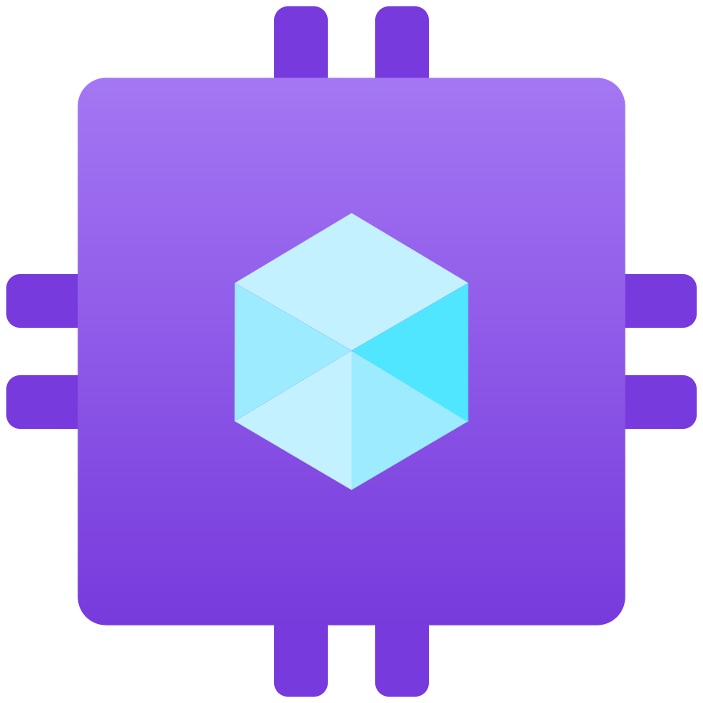
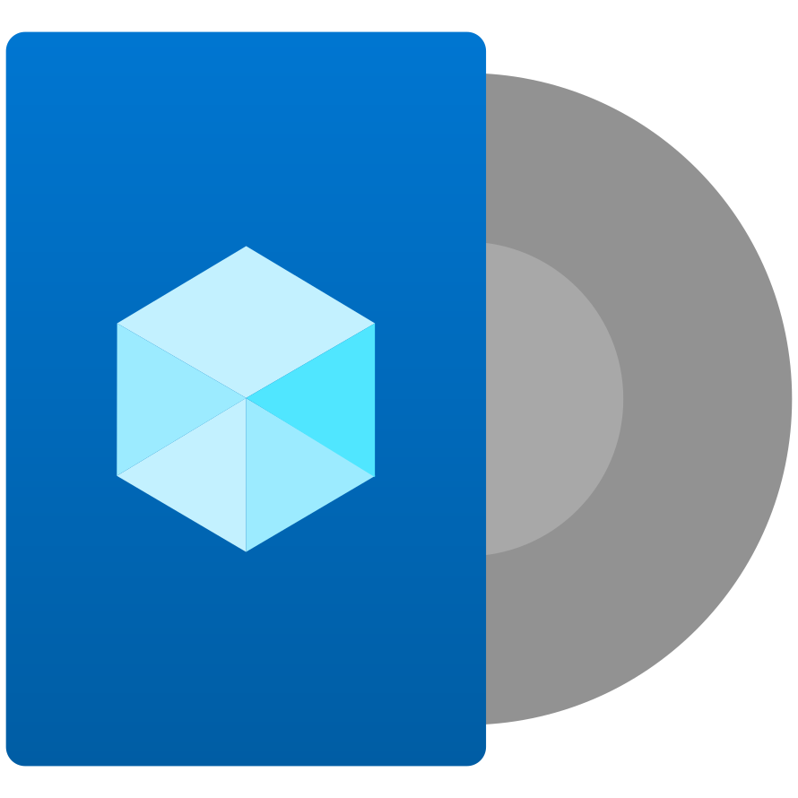
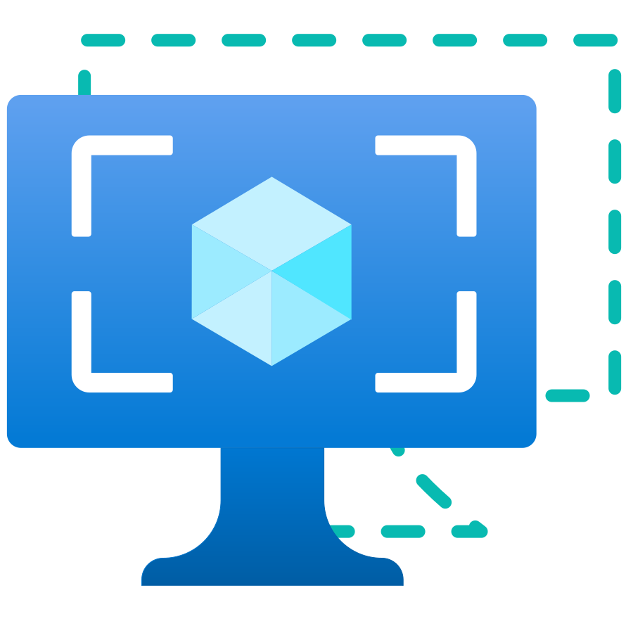
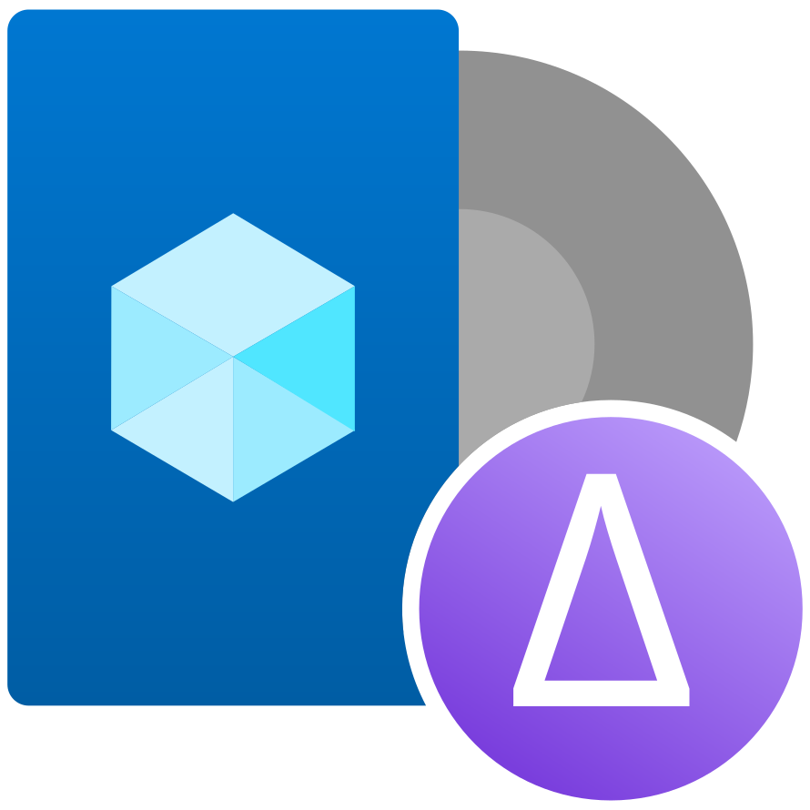
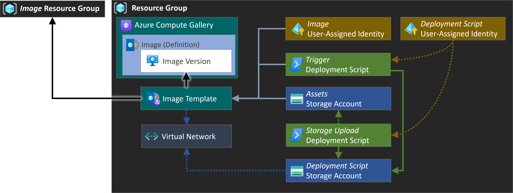
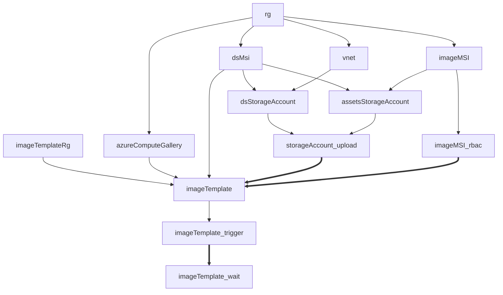
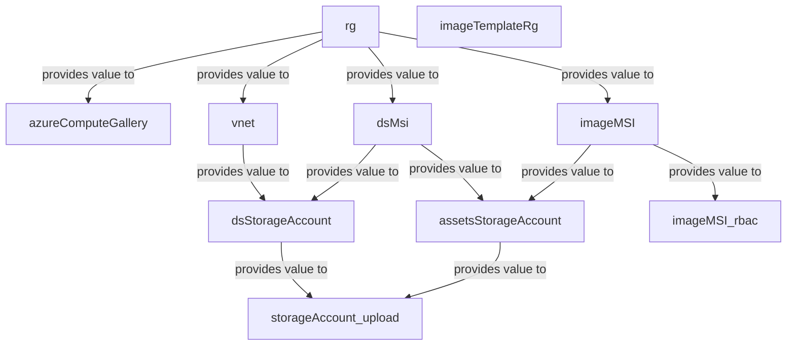
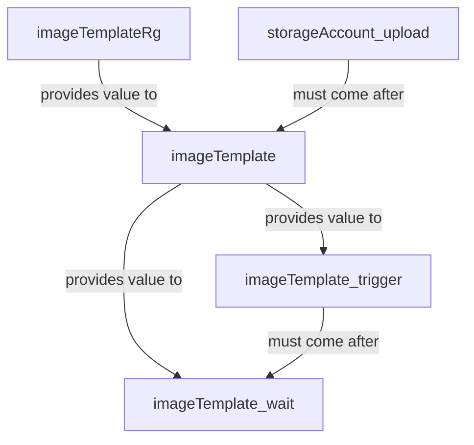
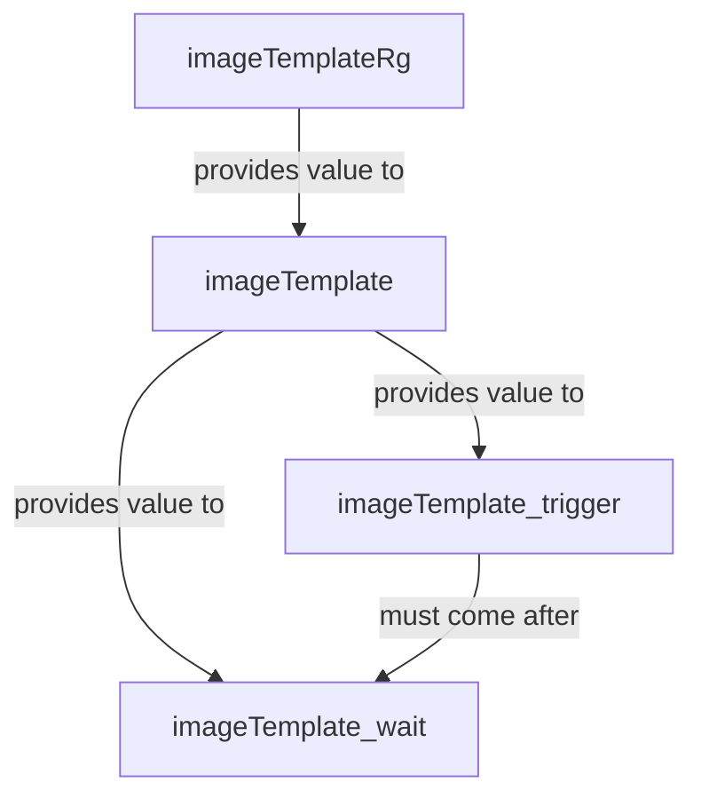

### Prerequisites

The deployments described in the following sections assume certain prerequisites to be in place prior to deployment.

- The deployment principal (e.g., the Service Principal tied to the deploying Service Connection) must have at least `Contributor` & `User Access Adminitrator` permissions on the target subscription to be able to deploy both resources and assign permissions to created user-assigned identities
- If you have a policy in place that prevents Storage Accounts from being deployed without a Firewall, you have to create an exemption for the Image Template / Staging Resource Group you can configure for the Image Template Resource (parameter `imageTemplateResourceGroupName`). The rationale is that the Azure-Image-Builder service uses this resource group to deploy both temporal resources used during the image build (e.g., a Virtual Machine), as well as a Storage Account to store temporal files & a 'packerlogs/customization.log' file in (which contains the logs of the image build). This Storage Account has no firewall configured, has a random name, and cannot be configured at deploy time.

### Elements
The image creation uses several components:

| &nbsp;&nbsp;&nbsp; | Resource | Description |
|--|--|--|
|  | Resource Group | The resource group hosting the image resources |
|  | (Image) Resource Group | The resource group hosting the resources created during the image build |
|  | (Assets) Storage Account | The storage account that hosts the image customization scripts used by the _Azure Image Building_ when executing the image template. |
|  | (DS) Storage Account | The storage account that hosts the files of the Deployment Scripts. Required for private networking. |
|  | (Image) User-Assigned Managed Identity | Azure Active Directory feature that eliminates the need for credentials in code, rotates credentials automatically, and reduces identity maintenance. In the context of the imaging construct, the managed identity (MSI) is used by the Image Builder Service. It is assigned contributor permissions on the subscription to be able to bake the image. Further, it is assigned read permissions on the Assets Storage Account Container in order to consume the customization scripts. |
|  | (DS) User-Assigned Managed Identity | Azure Active Directory feature that eliminates the need for credentials in code, rotates credentials automatically, and reduces identity maintenance. In the context of the imaging construct, the managed identity (MSI) is used by the Image Builder Service. It's assigned permissions on the Image Template to trigger it, the Deployment Script Storage Account for Private Networking, and the Assets Storage Account to upload files.  |
|  | (Storage) Deployment Script | The Deployment Script that uploads the customization scripts to the Assets Storage Account. |
|  | (Trigger) Deployment Script | The Deployment Script that triggers the Image Template build. |
|  | Azure Compute Gallery | Azure service that helps to build structure and organization for managed images. Provides global replication, versioning, grouping, sharing across subscriptions and scaling. The plain resource in itself is like an empty container. |
|  | Azure Compute Gallery Image | Created within a gallery and contains information about the image and requirements for using it internally. This includes metadata like whether the image is Windows or Linux, release notes and recommended compute resources. Like the image gallery itself it acts like a container for the actual images. |
|  | Image Template | A standard Azure Image Builder template that defines the parameters for building a custom image with AIB. The parameters include image source (Marketplace, custom image, etc.), customization options (i.e., Updates, scripts, restarts), and distribution (i.e., managed image, Azure Compute Gallery). The template is not an actual resource. Instead, when an image template is created, Azure stores all the metadata of the referenced Azure Compute Gallery Image alongside other image backing instructions as a hidden resource in a temporary resource group. |
|  | Image Version | An image version (for example `0.24322.55884`) is what you use to create a VM when using a gallery. You can have multiple versions of an image as needed for your environment. This value **cannot** be chosen. |

### First deployment
When triggering the deployment for the first time, make sure you either select `All` or `Only base` for the `deploymentsToPerform` parameter. In either case the template will deploy all resources and scripts you will subsequently need to create the images. For any subsequent run, you can go with any option you need.

The steps the _Azure Image Builder_ performs on the image are defined by elements configured in the `customizationSteps` parameter of the image template parameter file. In our setup we [Usage Examples](#usage-examples) we use one or multiple custom scripts that are uploaded by the template to a storage account ahead of the image deployment.

### Mermaid Graphs

The following graphs show which services are created based on the chosen `deploymentsToPerform`. As such, they show a (simplified) view of the order and relations in between the included deployments.

#### (Simplified) All

#### (Simplified) Only base

#### Only assets & image
Assumes all other services + permissions are deployed

#### Only image
Assumes all other services + permissions are deployed

### Troubleshooting

Most commonly issues with the construct occur during the image building process due to script errors. As those are hard to troubleshoot and the AIB VMs that are used to bake images are not accessible, the AIB service writes logs into a storage account in the 'staging' resource group it generates during the building process as documented [here](https://docs.microsoft.com/en-us/azure/virtual-machines/linux/image-builder-troubleshoot#customization-log).

Aside from the packer logs, it will also contain the logs generated by the provided customization scripts and hence provide you insights into 'where' something wrong, and ideally also 'what' went wrong.

