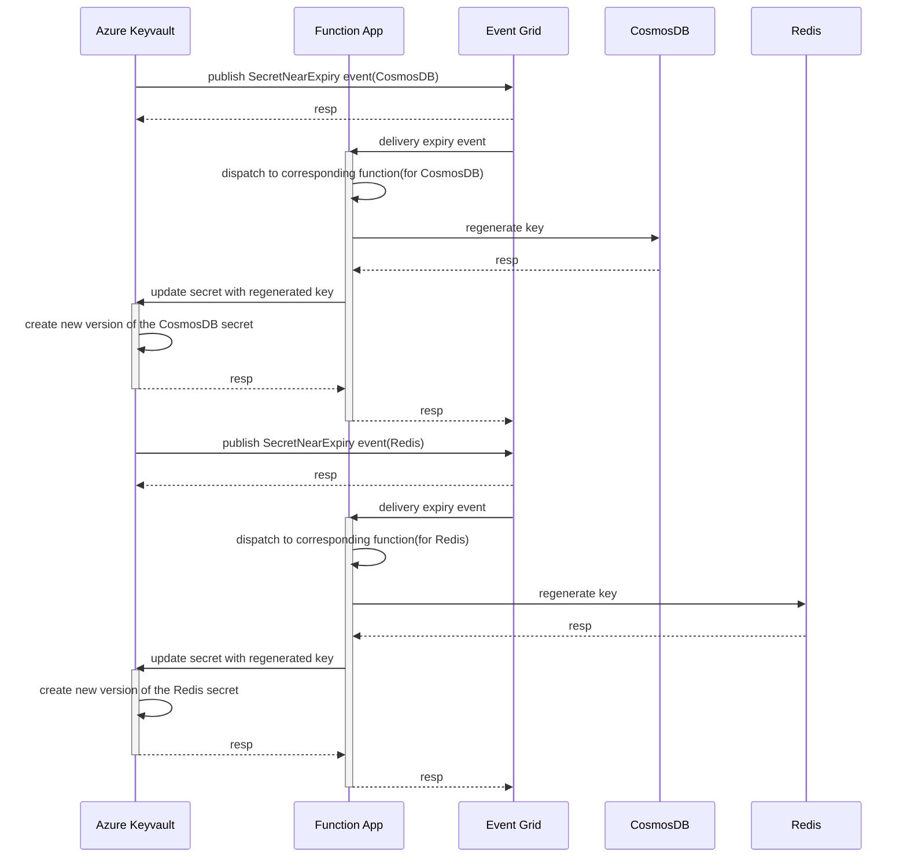

# Azure Keyvault secret auto-rotation

This module creates a function app that will automatically rotate a near expiry keyvault secret.

## Description

This module creates a Function app with the necessary components such storage account, system event grid, log analytic workspace etc. The app hosts different functions that will subscribe to the SecretNearExpiry event published by the given keyvault targeting the specific secret, so once the secret is about to expire, the corresponding function will be executed and renew the original access key on the target resource for example CosmosDB, and update the keyvault secret with the generated key. The module supports integration with vnet so that the functions can access resources privately. Currently the module supports rotating CosmosDB and Redis access keys, and can be extended to other types of resource as well.



## Parameters

| Name                         | Type     | Required | Description                                                                                                                                                                                                                                                                                                                                                                                                                                                                                                                                                                                                                                                                                                                                                                                                                                                                                       |
| :--------------------------- | :------: | :------: | :------------------------------------------------------------------------------------------------------------------------------------------------------------------------------------------------------------------------------------------------------------------------------------------------------------------------------------------------------------------------------------------------------------------------------------------------------------------------------------------------------------------------------------------------------------------------------------------------------------------------------------------------------------------------------------------------------------------------------------------------------------------------------------------------------------------------------------------------------------------------------------------------ |
| `secrets`                    | `array`  | Yes      | Definition of secrets to be auto-rotated. Includes name of the CosmosDB, name of the KeyVault, name of the Secret, name of the Resource Group etc.<br />  Example:<br />  [<br />    {<br />      type: 'cosmosdb', // mandatory, can be 'cosmosdb', 'redis'<br />      resourceName: 'cosmosdb-1',<br />      resourceRg: 'resource-group-1', // optional, default to parameter "resourceGroup().name"<br />      keyvaultRg: 'resource-group-1', // optional, default to parameter "resourceGroup().name"<br />      keyvaultName: 'keyvault-1',<br />      secretName: 'secret-1'<br />    }<br />  ]<br />  It's unlikely that for a single CosmosDB both primary and secondary keys are stored as keyvault secrets, normally one is used and later alternated to the other. Thus for now multiple keys are not supported.<br />  Note! Currently only support each CosmosDB having 1 secret. |
| `analyticWorkspaceId`        | `string` | Yes      | Resource ID of the log analytic workspace to be used by the function app.                                                                                                                                                                                                                                                                                                                                                                                                                                                                                                                                                                                                                                                                                                                                                                                                                         |
| `functionStorageAccountName` | `string` | Yes      | Storage account name for the function app.                                                                                                                                                                                                                                                                                                                                                                                                                                                                                                                                                                                                                                                                                                                                                                                                                                                        |
| `functionStorageAccountRg`   | `string` | No       | Resource group of the storage account, default to current resource group.                                                                                                                                                                                                                                                                                                                                                                                                                                                                                                                                                                                                                                                                                                                                                                                                                         |
| `location`                   | `string` | No       | Location to be used. Default to resource group's location.                                                                                                                                                                                                                                                                                                                                                                                                                                                                                                                                                                                                                                                                                                                                                                                                                                        |
| `tags`                       | `object` | No       | Tags to be added to the resources created by this module.                                                                                                                                                                                                                                                                                                                                                                                                                                                                                                                                                                                                                                                                                                                                                                                                                                         |
| `appServicePlanSku`          | `string` | No       | The type of App Service hosting plan. Premium must be used to access key vaults behind firewall. Default is EP1.                                                                                                                                                                                                                                                                                                                                                                                                                                                                                                                                                                                                                                                                                                                                                                                  |
| `functionAppName`            | `string` | No       | The name of the function app that you wish to create. Default is {resource group name}-rotation-fnapp.                                                                                                                                                                                                                                                                                                                                                                                                                                                                                                                                                                                                                                                                                                                                                                                            |
| `isEnableVnet`               | `bool`   | No       | True if vnet integration should be enabled. If set to false, the vnet related parameters will be ignored. Default to false.                                                                                                                                                                                                                                                                                                                                                                                                                                                                                                                                                                                                                                                                                                                                                                       |
| `functionAppSubnetId`        | `string` | No       | Name of the subnet to be assigned to function app. Leave empty if private network is not used.                                                                                                                                                                                                                                                                                                                                                                                                                                                                                                                                                                                                                                                                                                                                                                                                    |
| `isCreateFileShare`          | `bool`   | No       | True if the file share needs to be created in the storage account, this file share will host the function app files. The function app name will be used as the file share name. Default to true. NOTE: This seems required if using deployment script to provision the contents of the function app, if the fileshare does not exist at the time of creation, the deployment will fail.                                                                                                                                                                                                                                                                                                                                                                                                                                                                                                           |
| `fileShareName`              | `string` | No       | Name of the file share to be created, default to functionAppName.                                                                                                                                                                                                                                                                                                                                                                                                                                                                                                                                                                                                                                                                                                                                                                                                                                 |
| `isAssignStorageRole`        | `bool`   | No       | True if this module should assigned the role defined by param 'storageRoleId' to the function app identity. Supports user assigned identity only. Default is false.                                                                                                                                                                                                                                                                                                                                                                                                                                                                                                                                                                                                                                                                                                                               |
| `storageRoleId`              | `string` | No       | Id of role that should be assigned to the function identity for the storage account. Default to storage account contributor role ID.                                                                                                                                                                                                                                                                                                                                                                                                                                                                                                                                                                                                                                                                                                                                                              |
| `isStoragePrivate`           | `bool`   | No       | True if the storage on which the function will be created is accessible only from private network(vnet). Default to false.                                                                                                                                                                                                                                                                                                                                                                                                                                                                                                                                                                                                                                                                                                                                                                        |
| `functionAppIdentityType`    | `string` | No       | Function app identity type. Default is SystemAssigned, which means the identity created with the function app will be used.                                                                                                                                                                                                                                                                                                                                                                                                                                                                                                                                                                                                                                                                                                                                                                       |
| `userAssignedIdentityName`   | `string` | No       | Name of the user assigned identity used to execute the deployment script for uploading function app source code. Must be provided if NOT using MSDeploy option. If user assigned identity is chosen for the function app, this will also be the identity used. Only effective when 'functionAppIdentityType' is set to 'UserAssigned'.                                                                                                                                                                                                                                                                                                                                                                                                                                                                                                                                                            |
| `userAssignedIdentityRg`     | `string` | No       | Resource group name of the user assigned identity, default to current resource group.                                                                                                                                                                                                                                                                                                                                                                                                                                                                                                                                                                                                                                                                                                                                                                                                             |
| `deploymentScriptStorage`    | `string` | No       | Storage account name to be used by the deployment scripts. Deployment script by default create a temporary storage account during its execution but it is also possible to assign an existing storage instead.                                                                                                                                                                                                                                                                                                                                                                                                                                                                                                                                                                                                                                                                                    |
| `deploymentScriptStorageRg`  | `string` | No       | Resource group of the deployment script storage, if `deploymentScriptStorage`, this param will be ignored. Default to current resource group.                                                                                                                                                                                                                                                                                                                                                                                                                                                                                                                                                                                                                                                                                                                                                     |
| `isGrantExecutorRole`        | `bool`   | No       | True if the role with necessary permissions needed to execute the scripts for the function app is to be granted to the identity, either user assigned or system. Default to false.                                                                                                                                                                                                                                                                                                                                                                                                                                                                                                                                                                                                                                                                                                                |
| `isAssignResourceRole`       | `bool`   | No       | Depends on the resource type, whether to assign necessary role so that the identity can perform certain operations. E.g. for CosmosDB, granting function app permission to regenerate access key. Sometimes the user assigned identity is already assigned the roles so no need to do it again. Note! This param will be discarded if system assigned identity is used.                                                                                                                                                                                                                                                                                                                                                                                                                                                                                                                           |
| `systemTopicName`            | `string` | No       | Event grid topic name, to which the keyvault near expiry event will be subscribed.                                                                                                                                                                                                                                                                                                                                                                                                                                                                                                                                                                                                                                                                                                                                                                                                                |
| `systemTopicRg`              | `string` | No       | Resource group name of the event topic, default to current group. Will be ignored if system topic name is not provided.                                                                                                                                                                                                                                                                                                                                                                                                                                                                                                                                                                                                                                                                                                                                                                           |

## Outputs

| Name           | Type   | Description                       |
| :------------- | :----: | :-------------------------------- |
| id             | string | ID of the function app created.   |
| name           | string | Name of the function app created. |
| appInsightId   | string | ID of the App Insight created.    |
| appInsightName | string | Name of the App Insight created.  |
| serverFarmId   | string | ID of the server farm created.    |
| serverFarmName | string | Name of the server farm created.  |

## Examples

### Example 1

Create a rotation app without integrating with vnet.

```bicep
module rotation1 'br/public:keyvault/secret-autorotation:1.0.0' = {
  name: 'akv-rotate-1'
  scope: resourceGroup('group1')
  params: {
    location: resourceGroup().location
    functionStorageAccountName: 'storageaccount1'
    analyticWorkspaceId: '/subscriptions/xxxxxxxx-xxxx-xxxx-xxxx-xxxxxxxxxxxx/resourcegroups/group1/providers/microsoft.operationalinsights/workspaces/workspace1'
    secrets: [
      {
        type: 'cosmosdb'
        resourceName: 'cosmosdb1'
        resourceRg: 'group2'
        keyvaultName: 'keyvault1'
        keyvaultRg: 'group2'
        secretName: 'secret1'
      }
    ]
    userAssignedIdentityName: 'user-assigned-identity-1'
  }
}
```

### Example 2

Create a rotation app with integration to existing vnet. Assuming related resource, e.g. CosmosDB, StorageAccount, Keyvault etc, are bound to the vnet already.

```bicep
module rotatioin2 'br/public:keyvault/secret-autorotation:1.0.0' = {
  name: 'akv-rotate-2'
  scope: resourceGroup('group1')
  params: {
    location: resourceGroup().location
    functionAppName: 'myapp'
    isEnableVnet: true
    functionAppSubnetId: '/subscriptions/xxxxxxxx-xxxx-xxxx-xxxx-xxxxxxxxxxxx/resourceGroups/group2/providers/Microsoft.Network/virtualNetworks/vnet1/subnets/subnet1'
    functionStorageAccountName: 'storageaccount1'
    isCreateFileShare: true
    isAssignStorageRole: true
    isStoragePrivate: true
    analyticWorkspaceId: '/subscriptions/xxxxxxxx-xxxx-xxxx-xxxx-xxxxxxxxxxxx/resourcegroups/group1/providers/microsoft.operationalinsights/workspaces/workspace1'
    secrets: [
      {
        type: 'cosmosdb'
        resourceName: 'cosmosdb1'
        keyvaultName: 'keyvault1'
        secretName: 'secret1'
      }
      {
        type: 'cosmosdb'
        resourceName: 'cosmosdb2'
        resourceRg: 'group2'
        keyvaultName: 'keyvault1'
        keyvaultRg: 'group1'
        secretName: 'secret2'
      }
      {
        type: 'redis'
        resourceName: 'redis1'
        keyvaultName: 'keyvault2'
        keyvaultRg: 'group3'
        secretName: 'secret3'
      }
    ]
    functionAppIdentityType: 'UserAssigned'
    userAssignedIdentityName: 'user-assigned-identity-1'
    userAssignedIdentityRg: 'group3'
    systemTopicName: 'topic1'
    systemTopicRg: 'group4'
    isAssignResourceRole: true
  }
}
```